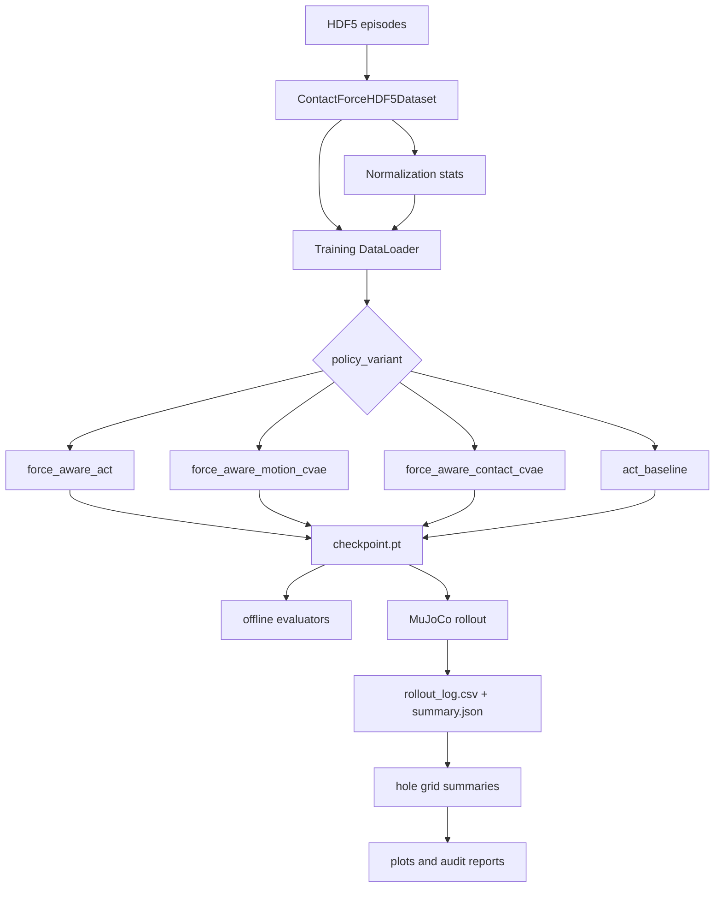

# ForceAwareACT Architecture

This document is the current architecture reference for the repository, audited against source on 2026-07-16. Source code and parser help, not historical reports, are the source of truth.

## End-to-End Flow



## Data Pipeline

`src/force_aware_act/data/contact_force_hdf5_dataset.py` implements `ContactForceHDF5Dataset`.

Expected HDF5 fields:

- State timestamps: `timestamps/state_episode` or `timestamps/state`.
- Image timestamps: `timestamps/image_episode` or `timestamps/image`.
- Force timestamps: `timestamps/force_episode` or `timestamps/force`.
- Cameras: `observations/images/<camera>`, default `ee_cam`, `base_top_cam`.
- State: `observations/joint_pos`, `observations/joint_vel`, `observations/joint_torque`, `observations/ee_pose`.
- Force: `observations/ft_wrench`.
- Actions: `observations/joint_pos`, root `action`, or `actions/joint_pos_command`.

Sample construction:

- Valid state indices are built per episode after safe length checks.
- State, image, and force groups tolerate mismatches up to `max_length_mismatch=1` by default.
- `joint_pos` action mode uses `action_offset=1` and labels `joint_pos[i+1:i+K+1]`.
- `action` and `joint_pos_command` use labels aligned at `i:i+K`.
- Delta action modes subtract current qpos from the selected action source.
- Current image is nearest image timestamp to the current state timestamp.
- Historical force window samples `force_window_len` timestamps from `t_state - force_window_duration` through `t_state`, using only force timestamps at or before each sample time.
- Future force chunk samples nearest force timestamp for each state timestamp `state_index + step`.
- End-of-episode samples are omitted when a full future action chunk cannot be read.

Images are scaled to `[0,1]`, resized with bilinear interpolation to `image_size`, converted to CHW, and optionally ImageNet-normalized.

## Normalization

`src/force_aware_act/data/normalization.py` computes running feature-wise mean/std for:

- `qpos`: current qpos.
- `action`: all elements of `action_chunk`.
- `force`: both historical `force_window` and `future_force_chunk`.

`scripts/compute_normalization_stats.py` saves a `torch.save` dictionary with tensor keys `qpos_mean`, `qpos_std`, `action_mean`, `action_std`, `force_mean`, `force_std`, plus metadata for action mode, chunk length, force window settings, cameras, image size, ImageNet flag, episode paths, and episode list.

Training/evaluation/rollout validate `action_mode` metadata when present. Rollout permits legacy stats without `action_mode` only for `action_mode='joint_pos'`.

The checks are not otherwise uniform: trainers do not automatically reject every mismatch in chunk length, force-window duration, cameras, image size, or ImageNet preprocessing. `train_minimal.py` and the other trainers reject stats episode-provenance mismatch only when validation is enabled. These settings therefore remain an explicit experiment-level invariant.

## Shared Model Building Blocks

- `ResNet18VisionEncoder`: image encoder producing visual spatial tokens.
- `JointMLP`: qpos token projection.
- `TemporalForceEncoder`: force-window Transformer encoder with CLS token.
- `ForceVisionCrossAttention`: fuses online force summary with visual tokens.
- `MotionPosteriorEncoder`: `q(z_motion | qpos, future actions)`.
- `ContactPosteriorEncoder`: `q(z_contact | qpos, future actions, future forces)`.
- `ContactPriorEncoder`: `p(z_contact | z_q, z_F_online, z_VF, visual_summary)`.
- `ActionHead`: predicts action chunks from decoder hidden states.
- `ForceHead`: predicts future force chunks from decoder hidden states and an auxiliary latent.

## Policy Families

### `force_aware_act`

Class: `ForceAwareACTPolicy` in `src/force_aware_act/models/policy.py`.

Role: full dual-latent model. It uses RGB images, current qpos, online historical force, `z_motion`, and `z_contact`.

Token order to the policy encoder:

```text
visual_tokens, z_VF, z_q, z_F_online, z_motion, z_contact
```

Training behavior:

- `contact_latent_mode='posterior'`: samples `z_motion` from the motion posterior and `z_contact` from the contact posterior. Also computes the contact prior for distillation.
- `contact_latent_mode='zero'`: uses zero motion and contact latents and skips posterior KL outputs.
- `contact_latent_mode='prior'` is rejected during training.

Deployment behavior:

- `zero`: exact zero motion latent and exact zero contact latent.
- `prior`: exact zero motion latent and deterministic contact prior mean unless `deterministic_prior=False`.
- `posterior` is rejected during deployment.

Heads and loss:

- Action head input: decoder hidden states.
- Force head input: decoder hidden states plus `z_contact`.
- Loss: `L = L1(action) + lambda_force * L1(force) + beta_motion * KL(q_motion||N(0,I)) + beta_contact * KL(q_contact||N(0,I)) + lambda_prior * L_prior` when posterior KL is enabled. `L_prior` is either MSE between prior/posterior means or KL `q_contact -> p_contact`.

### `force_aware_motion_cvae`

Class: `ForceAwareACTMotionCVAEPolicy` in `src/force_aware_act/models/force_aware_motion_cvae_policy.py`.

Role: structurally motion-only force-aware CVAE. It has no contact latent, contact posterior, or contact prior.

Token order:

```text
visual_tokens, z_VF, z_q, z_F_online, z_motion
```

Training samples `z_motion` from `qpos` and future actions. Future force labels are required by the forward validation for supervised force prediction, but they are not encoded into the latent. Deployment uses exact zero `z_motion` unless an evaluator provides `motion_latent_override`.

Heads and loss:

- Action head input: decoder hidden states.
- Force head input: decoder hidden states plus an all-zero auxiliary latent.
- Loss: `L = L1(action) + lambda_force * L1(force) + beta_motion * KL(q_motion||N(0,I))`.

### `force_aware_contact_cvae`

Class: `ForceAwareACTContactCVAEPolicy` in `src/force_aware_act/models/force_aware_contact_cvae_policy.py`.

Role: structurally contact-only force-aware CVAE. It has no motion latent or motion posterior.

Token order:

```text
visual_tokens, z_VF, z_q, z_F_online, z_contact
```

Training always requires `contact_latent_mode='posterior'`, future actions, and future forces. Deployment supports `zero` and `prior`. Offline posterior-oracle evaluation encodes `z_contact` separately and passes it through `contact_latent_override`.

Heads and loss:

- Action head input: decoder hidden states.
- Force head input: decoder hidden states plus `z_contact`.
- Loss: `L = L1(action) + lambda_force * L1(force) + beta_contact * KL(q_contact||N(0,I)) + lambda_prior * L_prior`.

### `act_baseline`

Class: `ACTPolicyBaseline` in `src/force_aware_act/models/act_policy.py`.

Role: force-free ACT-style Motion-CVAE baseline.

Token order:

```text
visual_tokens, z_q, z_motion
```

Training samples `z_motion` from qpos and future actions. Deployment uses exact zero `z_motion`. The model does not instantiate force encoder, force-vision fusion, force head, contact posterior, or contact prior.

Loss: `L = L1(action) + beta_motion * KL(q_motion||N(0,I))`.

## Offline Evaluation Modes

- Deployment zero: online-only zero latent path.
- Deployment prior: online-only deterministic conditional prior path for contact-capable policies.
- Offline posterior oracle: future labels are encoded to evaluate latent upper-bound behavior. This is not deployable.

Dedicated evaluators:

- `scripts/evaluate_inference_modes.py`: full dual-latent `force_aware_act`, with legacy ACT fallback behavior.
- `scripts/evaluate_motion_cvae_modes.py`: `force_aware_motion_cvae`.
- `scripts/evaluate_contact_cvae_modes.py`: `force_aware_contact_cvae`.
- `scripts/evaluate_act_baseline_modes.py`: `act_baseline`.

## Checkpoint Dispatch

Current training checkpoints contain:

```text
model_state_dict
optimizer_state_dict
config
step
```

Current `train_minimal.py` payloads additionally record epoch position, best-metric state, stop reason, training/DataLoader seeds, deterministic mode, resolved PyTorch thread counts, and an initial-model SHA-256. The ACT baseline and stage-2 trainers reuse the common envelope but do not expose the same seed/thread CLI controls.

`config.policy_variant` dispatches model construction. Missing or non-dict config generally falls back to `force_aware_act` in rollout and legacy dual-latent paths. Motion/contact evaluators can accept raw state dictionaries, but envelope checkpoints are checked for the matching policy variant and loaded strictly. ACT rollout supports legacy zero-latent baseline checkpoints through `LegacyZeroLatentACTPolicyBaseline`.

Duplicated construction exists in `train_minimal.py`, `train_act_baseline.py`, `evaluate_*_modes.py`, `run_policy_inference_smoke.py`, `debug_inference_modes.py`, and `run_mujoco_policy_rollout.py`.

## Rollout Architecture

`scripts/run_mujoco_policy_rollout.py`:

- Loads stats and validates `action_mode`.
- Loads checkpoint, dispatches policy, and loads state dict with `strict=True`.
- Renders `ee_cam` and `base_top_cam`.
- Reads MuJoCo sensor wrench from `peg_ft_force` and `peg_ft_torque`.
- Builds a historical force ring buffer and resamples it over `force_window_duration`.
- Normalizes qpos and force window.
- Runs deployable policy inference.
- Denormalizes action and predicted force.
- Selects action by `first`, `mid`, `last`, or `temporal`.
- Converts delta action modes to target qpos.
- Optionally adds axial push bias.
- Applies `max_delta_q` clipping, EMA, then actuator control-range clipping.
- Stops on nonfinite values, hard force threshold, or held success when enabled.
- Writes `rollout_log.csv`, `summary.json`, snapshots, and videos when requested.

Task success is held distance/lateral/force threshold satisfaction. Safe success is computed by grid summaries as task success with max force below the configured success force threshold. Hard force stop is immediate termination on `force_norm > force_stop_threshold`.

`scripts/run_mujoco_hole_grid.py` supports generated `grid`, `random`, and `latin_hypercube` points plus exact replay from `--sampling-mode file --task-points-csv ...`. Generated point coordinates use `point_set_seed`; rollout `i` uses `rollout_seed_base + i - 1`. The x/z suite forwards fixed point files, while the multi-seed suite can form a Cartesian product of point-set and rollout seed bases and isolate each configuration in its own output directory.

## Extension Guide

To add another policy variant, update these locations consistently:

- Policy class and exports in `src/force_aware_act/models/__init__.py`.
- Loss function and exports in `src/force_aware_act/training/__init__.py`.
- `POLICY_VARIANT_CHOICES`, model dispatch, config metadata, and loss dispatch in `scripts/train_minimal.py` or a dedicated trainer.
- Checkpoint dispatch in rollout and all relevant evaluators.
- `scripts/audit_model_components.py` component grouping.
- Offline evaluator for deployable and oracle modes.
- Tests for forward validation, gradients, loss equation, checkpoint dispatch, rollout dispatch, and documentation commands.

## Architecture Risks

- Dispatch and model configuration are duplicated across scripts.
- Training has no resume CLI.
- Stats/action-mode compatibility checks are repeated and slightly different by consumer.
- Rollout CLI contains contact-latent flags even for policies that ignore them.
- Force physical conventions are implicit and unverified.
- `evaluate_motion_cvae_modes.py` uses `Path(episode_path).stem` for `episode_identifier`, so distinct files named `episode.hdf5` can collapse to `episode`. `evaluate_contact_cvae_modes.py` uses the parent episode directory name, with a stem fallback.
- Not every consumer enforces all stats/checkpoint preprocessing metadata.
- Training seed/thread controls are currently asymmetric across trainers.
- `evaluate_dataset_quality.py` targets the current command-labelled recording schema and is stricter than the general dataset reader (for example, it requires `*_episode` timestamps and `actions/joint_pos_command`).
- `run_xz_rollout_suite.py`, `monitor_dataset_scaling_rollout.py`, and `analyze_rollout_safety_threshold.py` are experiment-specific and contain assumed model names/directory layouts.
