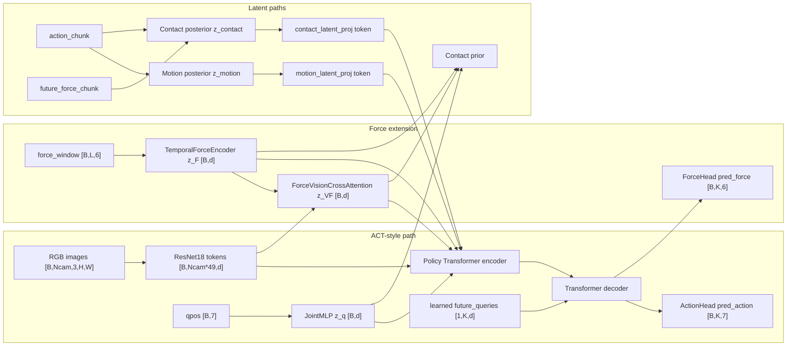

# ACT Backbone / Force Extension Audit

## 1. Executive Summary

This audit separates the current code into an ACT-style base, ForceAwareACT additions, latent extensions, and rollout/project infrastructure. It is documentation plus a read-only parameter-count utility only; it does not implement or refactor an ACT baseline.

Main finding: the current `ForceAwareACTPolicy` always instantiates and uses the force path in the action forward pass. `force_window -> TemporalForceEncoder -> z_F_online` and `z_F_online + visual_tokens -> ForceVisionCrossAttention -> z_VF` are concatenated into the policy encoder tokens before the action decoder runs ([`policy.py:176`](../../src/force_aware_act/models/policy.py#L176)-[`261`](../../src/force_aware_act/models/policy.py#L261)). Therefore action loss gradients reach force modules. The auxiliary force loss is computed from `pred_force`, which depends on `decoder_hidden`; its gradients reach the shared Transformer, vision, qpos, force encoder, and fusion paths unless parameters are frozen ([`losses.py:44`](../../src/force_aware_act/training/losses.py#L44)-[`58`](../../src/force_aware_act/training/losses.py#L58)).

The successful 20k zero-latent experiment path is not present as a local checkpoint in this macOS workspace. The closest available local checkpoint with explicit zero latent is `outputs/peg_hole_playback_test/overfit_action_trainzero_all10_5k/checkpoint.pt`; it records `action_mode=action`, `train_latent_mode=zero`, `chunk_len=10`, `force_window_len=20`, `force_window_duration=0.25`, two cameras, from-scratch ResNet18, `lambda_force=0.1`, and the small `d_model=128` model. The 20k/batch-16/max-delta/LHS details below are experiment-record-derived from existing docs, not checkpoint-verified locally.

Parameter audit for the default synthetic ForceAwareACT config used by `scripts/audit_model_components.py`:

| Group | Total | Trainable | Percent |
| --- | ---: | ---: | ---: |
| vision backbone | 11,242,176 | 11,242,176 | 92.1300% |
| state projection | 17,536 | 17,536 | 0.1437% |
| Transformer encoder | 132,480 | 132,480 | 1.0857% |
| Transformer decoder | 198,784 | 198,784 | 1.6290% |
| action queries/action head | 2,183 | 2,183 | 0.0179% |
| motion latent modules | 142,496 | 142,496 | 1.1678% |
| force temporal encoder | 136,192 | 136,192 | 1.1161% |
| force-vision fusion | 66,048 | 66,048 | 0.5413% |
| force head | 870 | 870 | 0.0071% |
| contact latent/prior/posterior | 263,744 | 263,744 | 2.1614% |
| other/unclassified | 0 | 0 | 0.0000% |
| total | 12,202,509 | 12,202,509 | 100% |

## 2. Repository Entry Points

Principal execution paths:

| Path | Source |
| --- | --- |
| Dataset sample construction | `ContactForceHDF5Dataset.__getitem__`: reads synchronized state/image/force/action data, samples past force, future action, future force ([`contact_force_hdf5_dataset.py:279`](../../src/force_aware_act/data/contact_force_hdf5_dataset.py#L279)-[`344`](../../src/force_aware_act/data/contact_force_hdf5_dataset.py#L344)). |
| Batch collation | Standard PyTorch `DataLoader` in training/eval scripts; no custom collate in repo ([`train_minimal.py:185`](../../scripts/train_minimal.py#L185)-[`190`](../../scripts/train_minimal.py#L190)). |
| Model construction | `ForceAwareACTPolicy.__init__` instantiates all ACT, force, motion, contact, Transformer, and head modules ([`policy.py:83`](../../src/force_aware_act/models/policy.py#L83)-[`157`](../../src/force_aware_act/models/policy.py#L157)). |
| Training forward pass | `train_minimal.py` passes `images`, `qpos`, `force_window`, `action_chunk`, `future_force_chunk`, `is_training=True`, and `contact_latent_mode=args.train_latent_mode` ([`train_minimal.py:257`](../../scripts/train_minimal.py#L257)-[`265`](../../scripts/train_minimal.py#L265)). |
| Loss computation | `compute_force_aware_act_loss` computes action L1, future-force L1, optional motion/contact KL, optional prior distillation ([`losses.py:25`](../../src/force_aware_act/training/losses.py#L25)-[`87`](../../src/force_aware_act/training/losses.py#L87)). |
| Evaluation forward pass | `evaluate_inference_modes.py` runs zero, prior, and posterior/contact modes against batches; posterior mode uses future labels only offline. |
| MuJoCo rollout inference | `run_mujoco_policy_rollout.py` loads checkpoint/stats, builds normalized online tensors, calls model with `is_training=False`, denormalizes, selects an action, clips/smooths/executes ([`run_mujoco_policy_rollout.py:547`](../../scripts/run_mujoco_policy_rollout.py#L547)-[`573`](../../scripts/run_mujoco_policy_rollout.py#L573), [`970`](../../scripts/run_mujoco_policy_rollout.py#L970)-[`1162`](../../scripts/run_mujoco_policy_rollout.py#L1162)). |
| Checkpoint loading | Evaluation/rollout reconstruct from `checkpoint["config"]["model"]`, force `pretrained_resnet18=False` default, set dropout/max force length defaults, then `load_state_dict` ([`run_mujoco_policy_rollout.py:167`](../../scripts/run_mujoco_policy_rollout.py#L167)-[`180`](../../scripts/run_mujoco_policy_rollout.py#L180)). |

## 3. Component Taxonomy

Primary categories are assigned by whether a component affects model forward, loss, gradients, or rollout control.

| Component | Category | Source file | Class/function | Input shape | Output shape | Train? | Inference? | Grad? | Config? | Active in 20k zero-latent? | ACT baseline? | ForceAwareACT? | Notes |
| --- | --- | --- | --- | --- | --- | --- | --- | --- | --- | --- | --- | --- | --- |
| multi-camera images | ACT backbone | `contact_force_hdf5_dataset.py:370`, `vision.py:61` | `_read_images`, `ResNet18VisionEncoder.forward` | dataset `[N,H,W,3]`; model `[B,N_cam,3,H,W]` | `[B,N_cam*49,d_model]` at 224 | yes | yes | yes | cameras, image size, ImageNet normalize | yes | retain | required | Shared ResNet per camera. |
| image resize/scale/ImageNet norm | ACT backbone | `contact_force_hdf5_dataset.py:386` | `_preprocess_image` | `[H,W,3]` | `[3,224,224]` default | yes | rollout mirrors resize | no | image size, `imagenet_normalize` | scale yes, ImageNet no | match | required | Current training does not enable ImageNet normalization by default. |
| qpos | ACT backbone | `contact_force_hdf5_dataset.py:287`, `policy.py:177` | dataset, `JointMLP` | `[B,7]` | `[B,d_model]` | yes | yes | yes | action/state stats | yes | retain | required | Only online proprioception consumed by policy. |
| qvel | Shared project infrastructure | `contact_force_hdf5_dataset.py:288` | dataset output | `[7]` | batch `[B,7]` | loaded only | logged only | no | none | loaded only | not model | optional data | Not passed to policy. |
| joint torque | Shared project infrastructure | `contact_force_hdf5_dataset.py:289` | dataset output | `[7]` | batch `[B,7]` | loaded only | logged only | no | none | loaded only | not model | optional data | Not passed to policy. |
| ee_pose | Shared project infrastructure | `contact_force_hdf5_dataset.py:292` | dataset output | `[7]` | batch `[B,7]` | loaded only | logged only | no | none | loaded only | not model | optional data | Not passed to policy. |
| force_window | Force extension | `contact_force_hdf5_dataset.py:193`, `policy.py:178` | `_sample_past_force_window`, `TemporalForceEncoder` | `[B,L,6]` | `[B,d_model]` | yes | yes | yes | length/duration/stats | yes | remove | required | Past-only in dataset and rollout. |
| action_chunk | ACT backbone | `contact_force_hdf5_dataset.py:439`, `losses.py:44` | `_read_action_chunk`, action L1 | `[B,K,7]` | target for `pred_action` | yes | no input | target only | action mode, K | yes | retain | required | `joint_pos` offset differs from command modes. |
| future_force_chunk | Force extension | `contact_force_hdf5_dataset.py:317`, `losses.py:45` | future target, force L1 | `[B,K,6]` | target for `pred_force` | yes | no input | target only; loss grads flow from pred | lambda_force | yes | remove | required for aux | Future force is never inference input. |
| normalization stats | Shared project infrastructure | `normalization.py:53`, `train_minimal.py:93` | `compute_normalization_stats`, `_normalize_batch` | qpos/action/force tensors | normalized tensors | yes | yes | no | stats path | yes if stats provided | match | required | Force stats shared by force window and future force. |
| vision backbone | ACT backbone | `vision.py:26` | `ResNet18VisionEncoder` | `[B,N_cam,3,H,W]` | `[B,N_cam*49,d_model]` | yes | yes | yes | model config | yes | retain | required | Constructor default pretrained=True, training sets False. |
| camera token handling | ACT backbone | `vision.py:68` | flatten/reshape tokens | `[B*N_cam,3,H,W]` | camera-concat tokens | yes | yes | yes | camera count | yes | retain | required | No camera ID embedding in current code. |
| robot-state projection | ACT backbone | `policy.py:18` | `JointMLP` | `[B,7]` | `[B,d_model]` | yes | yes | yes | q_dim/d_model | yes | retain | required | Two-layer MLP. |
| force temporal encoder | Force extension | `force.py:9` | `TemporalForceEncoder` | `[B,L,6]` | `[B,d_model]` | yes | yes | yes | force_dim, max L, Transformer args | yes | remove | required | CLS + learned pos embed means zero input can still produce nonzero token. |
| force-vision fusion | Force extension | `cross_attention.py:9` | `ForceVisionCrossAttention` | `[B,d]`, `[B,Nv,d]` | `[B,d]` | yes | yes | yes | d/nhead/dropout | yes | remove | required | Force token queries visual tokens. |
| motion posterior | Motion-latent / ACT-CVAE | `posterior.py:27` | `MotionPosteriorEncoder` | qpos `[B,7]`, action `[B,K,7]` | mu/logvar/z `[B,z]` | only posterior mode | no | yes if active | train latent mode | no in zero-latent | separate | optional | Instantiated even when zero mode skips it. |
| contact posterior | Contact-latent extension | `posterior.py:92` | `ContactPosteriorEncoder` | qpos/action/future force | mu/logvar/z `[B,z]` | only posterior mode | no | yes if active | train latent mode | no in zero-latent | remove | optional/full | Uses future force, so training-only. |
| contact prior | Contact-latent extension | `contact_prior.py:13` | `ContactPriorEncoder` | z_q, z_F, z_VF, visual summary | mu/logvar/z `[B,z]` | posterior mode if prior loss path | prior inference | yes if active | contact latent mode, lambda_prior | no in zero rollout | remove | optional/full | Rollout default is `prior`, but successful noted zero rollout disables it. |
| latent projections | Motion/contact latent components | `policy.py:133` | `motion_latent_proj`, `contact_latent_proj` | `[B,z]` | token `[B,d]` | yes | yes | yes for weights | z_dim/d_model | yes, with zero input | motion separate; contact remove | required in current | Bias can create nonzero token from zero latent. |
| policy Transformer encoder | ACT backbone | `policy.py:136` | `policy_encoder` | `[B,Ntokens,d]` | memory `[B,Ntokens,d]` | yes | yes | yes | d/layers/heads | yes | retain | required | Current token set includes force/contact tokens. |
| policy Transformer decoder | ACT backbone | `policy.py:145` | `policy_decoder` | queries + memory | `[B,K,d]` | yes | yes | yes | d/layers/heads | yes | retain | required | Decoder memory is force-augmented in current model. |
| learned action queries | ACT backbone | `policy.py:153` | `future_queries` | `[1,K,d]` | `[B,K,d]` | yes | yes | yes | chunk_len/d | yes | retain | required | Parameter, truncated-normal init. |
| action head | ACT backbone | `heads.py:11` | `ActionHead` | `[B,K,d]` | `[B,K,7]` | yes | yes | yes | action_dim | yes | retain | required | Linear by default. |
| force head | Force extension | `heads.py:36` | `ForceHead` | decoder `[B,K,d]`, z_contact `[B,z]` | `[B,K,6]` | yes | yes output only | yes | force_dim/z_dim | yes | remove | required for aux | Still predicts in inference, used for logging/diagnostics. |
| action loss | ACT backbone | `losses.py:44` | L1 | pred/target `[B,K,7]` | scalar | yes | no | yes | implicit weight 1 | yes | retain | required | No padding mask currently. |
| force loss | Force extension | `losses.py:45` | L1 | pred/target `[B,K,6]` | scalar | yes | no | yes if lambda>0 | lambda_force | yes | remove | required for aux | `lambda_force=0` stops force-loss gradient but not force input path. |
| motion KL | Motion-latent / ACT-CVAE | `losses.py:46` | `kl_normal` | mu/logvar `[B,z]` | scalar | posterior mode | no | yes if active | beta_motion | no in zero-latent | separate | optional | Zero mode sets `use_posterior_kl=False`. |
| contact KL | Contact-latent extension | `losses.py:49` | `kl_normal` | mu/logvar `[B,z]` | scalar | posterior mode | no | yes if active | beta_contact | no in zero-latent | remove | optional/full | Not ACT. |
| prior matching | Contact-latent extension | `losses.py:60` | `compute_contact_prior_distillation_loss` | posterior/prior stats | scalar | posterior + lambda_prior>0 | no | yes to prior | lambda_prior/mode | no | remove | optional/full | Posterior target detached. |
| action selection | Rollout/execution extension | `run_mujoco_policy_rollout.py:1059` | first/mid/last/temporal | `[K,7]` | `[7]` | no | yes | no | action_select_mode | mid in successful docs | match setting | rollout infra | Default CLI is first. |
| clipping/EMA | Rollout/execution extension | `run_mujoco_policy_rollout.py:1142` | `max_delta_q`, EMA, ctrlrange | target `[7]` | ctrl `[7]` | no | yes | no | max_delta_q, ema_alpha | yes | match | rollout infra | Not model architecture. |
| force-stop/success-stop | Rollout/execution extension | `run_mujoco_policy_rollout.py:1039` | thresholds | scalars | stop reason | no | yes | no | thresholds | yes | match eval | rollout infra | Deployment/evaluation guard. |
| hole randomization/grid | Evaluation/logging infrastructure | `run_mujoco_hole_grid.py` | rollout wrapper | offsets | summary | no | eval | no | seed/offsets | 50 LHS in docs | match eval | eval infra | Not policy architecture. |

## 4. Architecture / Data-Flow Diagram



## 5. Tensor and Gradient Paths

RGB images: dataset reads camera frames, scales/resizes to `[N_cam,3,224,224]`, DataLoader batches to `[B,N_cam,3,224,224]`, ResNet18 produces `[B,N_cam*49,d_model]`, policy encoder/decoder produce `[B,K,d_model]`, action head produces `[B,K,7]`, action L1 backpropagates through action head, decoder, encoder, visual tokens, and ResNet. Force loss also reaches vision because `pred_force` uses `decoder_hidden`.

qpos: dataset returns `observations/joint_pos[state_index]` as `[7]`, normalization optionally applies `qpos_mean/std`, `JointMLP` maps `[B,7] -> [B,d]`, the token enters the policy encoder and action loss reaches it. qvel, joint torque, and ee_pose exist in samples but have no policy input argument and receive no gradients.

force_window: dataset samples only force timestamps at or before the state time using `np.searchsorted(..., side="right") - 1` ([`contact_force_hdf5_dataset.py:207`](../../src/force_aware_act/data/contact_force_hdf5_dataset.py#L207)-[`216`](../../src/force_aware_act/data/contact_force_hdf5_dataset.py#L216)). After optional force normalization it enters `TemporalForceEncoder`, which projects force samples, prepends a learned CLS token, adds learned positional embeddings, and returns the CLS output ([`force.py:68`](../../src/force_aware_act/models/force.py#L68)-[`73`](../../src/force_aware_act/models/force.py#L73)). Action loss gradients reach `force_encoder` through both `z_F_online` and `z_VF`; this remains true in zero-latent mode.

future_force_chunk: dataset aligns future state times to nearest force timestamps ([`contact_force_hdf5_dataset.py:317`](../../src/force_aware_act/data/contact_force_hdf5_dataset.py#L317)-[`324`](../../src/force_aware_act/data/contact_force_hdf5_dataset.py#L324)). It is a target only. Force loss backpropagates from `pred_force` through `ForceHead`, decoder, policy encoder, and all tokens that feed memory, including vision, qpos, force encoder, and force-vision fusion. It does not feed inference.

motion latent: in posterior training, `MotionPosteriorEncoder(qpos, action_chunk)` emits `mu_motion`, `logvar_motion`, and sampled `z_motion`; KL is optional via `use_posterior_kl`. In zero-latent training and all inference, `z_motion` is a zero tensor, but `motion_latent_proj` is still called and its bias can yield a nonzero token.

contact latent: in posterior training, `ContactPosteriorEncoder(qpos, action_chunk, future_force_chunk)` emits `z_contact`, and `ContactPriorEncoder` may be evaluated for prior distillation. In training zero mode, posterior/prior are skipped and `z_contact=0`; in inference zero mode the prior is skipped; in inference prior mode the prior uses online qpos/force/fusion/vision summary. `contact_latent_proj` and `ForceHead` still receive zero contact latent in zero mode, so their biases remain active.

Zero force input is not equivalent to removing force modules. A raw physical zero force becomes `(0 - force_mean) / force_std` after normalization unless force mean is zero. Even a normalized all-zero `force_window` can produce nonzero features because `TemporalForceEncoder` has `force_proj` bias, learned CLS token, learned positional embedding, Transformer biases/norms, and downstream cross-attention projections.

## 6. Training / Inference Activation Matrix

| Setting | Parser default | Constructor default | Checkpoint metadata | Successful experiment value | Effect |
| --- | --- | --- | --- | --- | --- |
| camera names | train/eval `ee_cam base_top_cam` | dataset same | saved top-level | `ee_cam`, `base_top_cam` | Controls image datasets and token count. |
| image size | `(224,224)` | dataset `(224,224)` | saved top-level | `(224,224)` | ResNet token grid 7x7 per camera at 224. |
| ImageNet normalization | false | false | saved top-level | false | Dataset preprocessing only. |
| pretrained ResNet18 | no CLI; hard-coded false | policy default true | `model.pretrained_resnet18` | false | Must match for fresh instantiation; checkpoint weights override after load. |
| freeze backbone | no CLI | false | usually absent | false/inferred | If true only ResNet backbone frozen, projection trainable. |
| qpos/qvel/torque/ee_pose | qpos passed; others loaded | qpos only | not separate | qpos only | Extra state fields inactive. |
| action mode | train default `joint_pos`; rollout default `joint_pos` | dataset default `joint_pos` | saved top-level in newer ckpts | `action` for successful command experiment | Target semantics and rollout interpretation. |
| chunk length | train default 10 | policy default 50 | saved top/model | 10 | Action query length and heads. |
| force-window length | train default 20 | force max default 256 | saved top-level | 20 | Dataset/rollout force sampling and max pos embed. |
| force-window duration | 0.25 | dataset default 0.25 | saved top-level | 0.25 | Time span of force history. |
| train latent mode | parser default posterior | forward default posterior if training | saved newer ckpts | zero | Zero skips posterior/prior and KL. |
| contact latent mode rollout | default prior | forward default zero if inference | rollout summary | zero | Zero skips contact prior. |
| lambda_force | train default 0.1 | loss default 0.1 | saved top-level | 0.1 | Force loss gradient on/off by weight. |
| action loss weight | implicit 1 | implicit 1 | not explicit | 1 | Always present. |
| beta_motion/contact | `1e-4` max | loss default `1e-4` | saved top-level | 0 effective in zero mode | KL disabled in zero mode. |
| lambda_prior | train default 0.0 | loss default 0.0 | saved top-level | 0 | Prior loss inactive. |
| d_model | hard-coded 128 | policy default 512 | saved model | 128 | Parameter scale and token width. |
| encoder/decoder layers | hard-coded 1/1 | policy default 2/2 | saved model | 1/1 | Small experiment config. |
| attention heads | hard-coded 4 | policy default 8 | saved model | 4 | Must divide d_model. |
| dropout | train hard-coded 0.0 but not saved in older ckpts | policy default 0.1 | often absent | 0.0 inferred | Loader defaults missing dropout to 0.0. |
| batch size | train default 2 | n/a | saved top-level | 16 in successful docs, local zero ckpt 2 | Training only. |
| optimizer/LR | AdamW, `1e-4` | n/a | LR saved top-level, optimizer state saved | AdamW `1e-4` | Training only. |
| max steps | default 20 | n/a | saved step/max_steps | 20k docs; local zero ckpt 5k | Training duration. |

State labels: supported in code means parser/constructor accepts it; default enabled means parser/constructor activates it; successful enabled means experiment record/checkpoint uses it; inactive but instantiated means modules exist but forward branch skips them; neither instantiated nor used does not apply to current policy force/contact modules because they are always instantiated.

## 7. Parameter-Count Partition

The utility is [`scripts/audit_model_components.py`](../../scripts/audit_model_components.py). It instantiates the existing policy with synthetic config or checkpoint config, forces `pretrained_resnet18=False` to avoid downloads, reports total/trainable counts, and writes JSON to [`ACT_BACKBONE_FORCE_EXTENSION_AUDIT.json`](ACT_BACKBONE_FORCE_EXTENSION_AUDIT.json). Unknown names go to `other_unclassified`.

Command used:

```bash
PYTHONPATH=src .venv/bin/python scripts/audit_model_components.py \
  --device cpu \
  --json-output docs/architecture/ACT_BACKBONE_FORCE_EXTENSION_AUDIT.json
```

## 8. ACT Backbone Definition

Exact ACT-backbone components for the first matched baseline:

- `ContactForceHDF5Dataset` image loading/resizing/scaling for the same cameras and image size.
- `qpos` normalization and `JointMLP`.
- `ResNet18VisionEncoder` from scratch, same trainable/freeze behavior.
- `policy_encoder` and `policy_decoder` with matched `d_model`, layers, heads, feedforward dimension, dropout.
- `future_queries`.
- `ActionHead`.
- `action_chunk` target with the same absolute action mode as ForceAwareACT.
- L1 action reconstruction loss.
- Motion latent should be treated separately: primary controlled comparison should use zero-latent if ForceAwareACT uses `train_latent_mode=zero`; a later standard ACT-CVAE should use only motion posterior/KL.

## 9. Force Extension Definition

Exact force-extension components:

- Dataset `force_window` and `future_force_chunk`.
- Force normalization fields and rollout force-window resampling.
- `TemporalForceEncoder`.
- `ForceVisionCrossAttention`.
- `z_F_online` and `z_VF` tokens in `_assemble_policy_tokens`.
- `ForceHead`.
- `loss_force` and `lambda_force`.
- Force/contact diagnostics based on predicted force during rollout/evaluation.

## 10. Motion-Latent vs Contact-Latent Distinction

Motion latent is ACT-CVAE-like: `MotionPosteriorEncoder(qpos, action_chunk)`, `motion_latent_proj`, and `kl_motion`. Contact latent is ForceAwareACT-specific: `ContactPosteriorEncoder(qpos, action_chunk, future_force_chunk)`, `ContactPriorEncoder(z_q,z_F,z_VF,visual_summary)`, `contact_latent_proj`, `kl_contact`, and prior distillation. In zero-latent training, both posterior encoders are skipped, but both projection modules remain instantiated and called with zero tensors.

## 11. Rollout-Only Components

Rollout-only/evaluation-only additions include checkpoint/stats loading, image rendering, force ring buffer resampling, contact latent mode selection, first/mid/last/temporal action selection, denormalization, delta/absolute action interpretation, `max_delta_q` clipping, EMA smoothing, actuator ctrlrange clipping, force-stop, success-stop, axial push, hole offset/randomization, video/snapshot/log saving, and grid/LHS evaluation wrappers. These are not policy architecture, but must be matched for fair online comparisons.

## 12. Misleading Force-Off Configurations

| Scenario | Force encoder instantiated? | Can output nonzero? | Param count ACT-sized? | Force-loss grads? | Valid use |
| --- | --- | --- | --- | --- | --- |
| zero-valued raw `force_window` | yes | yes after normalization/bias/pos/CLS | no | yes if lambda>0 | inference intervention only |
| physical zero before normalization | yes | yes, becomes `-mean/std` | no | yes if lambda>0 | intervention, not ACT |
| raw training-set mean | yes | yes via learned tokens/biases | no | yes if lambda>0 | intervention |
| zero after normalization | yes | yes via bias/CLS/pos | no | yes if lambda>0 | capacity-retaining ablation |
| zero encoded force token | yes | fusion/token biases may remain if code changed | no | possibly | ablation, not current CLI |
| disable force loss only | yes | yes | no | no from force loss, yes from action loss | training ablation |
| disable force-vision cross-attn only | yes if force token retained | yes | no | depends on code | ablation, not true ACT |
| retain modules but never use outputs | yes | maybe unused | no | no if disconnected | capacity/implementation ablation |
| structurally remove all force modules/tokens/head/loss | no | no | yes if matched | no | true ACT-matched baseline |

## 13. Proposed ACT-Matched Baseline Boundary

Remove entirely in the later implementation:

- `force_window` as model input.
- `TemporalForceEncoder` and `force_encoder`.
- `ForceVisionCrossAttention` and `z_VF`.
- `z_F_online` token and force/fused tokens in `_assemble_policy_tokens`.
- `ForceHead`, `pred_force`, `future_force_chunk` supervision, and `loss_force`.
- `ContactPosteriorEncoder`, `ContactPriorEncoder`, `contact_latent_proj`, `z_contact`, contact KL, and prior distillation.

Retain unchanged:

- HDF5 episode selection and train/validation split.
- Same two RGB cameras, image size, image scaling/normalization setting.
- qpos input and qpos normalization.
- ResNet18 from-scratch initialization and trainability.
- Transformer dimensions/layers/heads/feedforward/dropout.
- learned future queries, action head, chunk length 10.
- same absolute action target mode used by the successful run.
- L1 action loss, AdamW, LR, batch size, max steps.
- rollout action selection, `max_delta_q`, success criterion, and 50-point LHS evaluation positions/seed.

Disable through configuration only if the code exposes clean structural flags in the future: force loss, contact prior inference, posterior KL. The current code does not expose a true structural ACT mode; disabling losses alone is insufficient.

Retrain from scratch: the ACT-matched baseline requires a new checkpoint. Existing ForceAwareACT checkpoints contain extra force/contact parameters and a force-augmented encoder context.

## 14. Method Variants

ForceAwareACT: images + qpos + force window, force encoder, force-vision fusion, force/action heads, optional contact prior/posterior.

ForceAwareACT with force intervention: same trained architecture and parameter count, but force input is modified at inference. This tests sensitivity to force, not an ACT baseline.

ForceAwareACT without force loss: same force-conditioned action path and parameter count; `lambda_force=0` removes auxiliary force-loss gradients only.

ACT-style zero-latent baseline: images + qpos, ACT Transformer/action chunk/L1, no force modules, no contact latent, zero motion latent. This is the first controlled comparison because the successful ForceAwareACT used zero latent.

Standard ACT-CVAE baseline: images + qpos plus motion posterior during training and zero motion latent at inference, motion KL active. This should be a separate experiment; do not mix latent-mode changes with force removal in the primary ablation.

## 15. Previous Document Comparison

`docs/architecture/ACT_ALIGNMENT_AUDIT.md` remains broadly accurate: it correctly identifies images/qpos/ResNet/Transformer/action L1 as ACT-like and force/contact modules as extensions. It is incomplete on the exact gradient implication that action loss reaches force modules because force tokens are inside the policy encoder context.

`docs/architecture/VISION_BACKBONE_AUDIT.md` remains accurate for current code and inspected checkpoints: training uses `pretrained_resnet18=False`; constructor defaults differ; freeze is supported but not exposed by training CLI. It is stale only in the sense that more local checkpoints now exist beyond the three listed.

`docs/research/EXPERIMENT_DESIGN_AND_PAPER_POSITIONING.md` remains accurate for experiment philosophy. It should be updated to reference this stricter boundary and to state that zero-force interventions are not true ACT baselines.

Recommended document updates: add the parameter-count table, add the force-off caveat table, and explicitly mark the 20k run values as checkpoint-verified only when the exact checkpoint is present.

## 16. Open Questions / Ambiguities

- Exact successful `outputs/peg_hole_100/action_trainzero_all100_20k_bs16/checkpoint.pt` is not present locally, so batch size 16, 20k steps, 50-point LHS seed/positions, `max_delta_q`, and action selection are document-derived.
- Current checkpoint metadata often omits `dropout`, `freeze_resnet18`, and older `train_latent_mode`; loaders infer defaults.
- No padding mask exists for action/force chunks; samples are built only where full chunks fit.
- The rollout default `contact_latent_mode=prior` and `action_select_mode=first` differ from the described successful zero/mid-style settings, so CLI defaults are not experiment settings.

## 17. Exact Recommended Next Implementation Step

Implement a separate ACT-style policy/config path that keeps the dataset, cameras, qpos normalization, action target, chunk length, ResNet18 initialization, Transformer dimensions, optimizer, batch size, training steps, and rollout evaluation fixed, while structurally omitting all force and contact modules/tokens/heads/losses. Train it from scratch as the primary zero-latent ACT-matched baseline, then run a separate standard ACT-CVAE comparison later.
