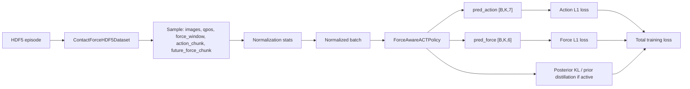
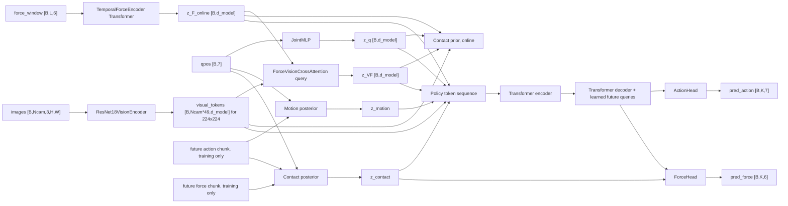
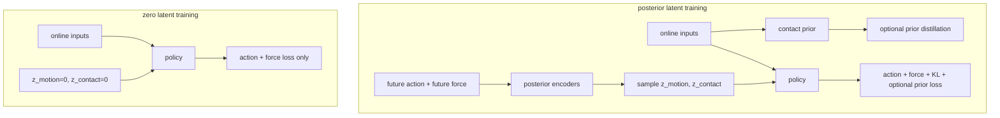
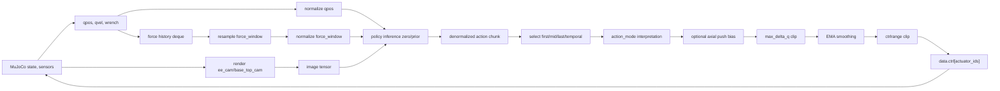

# ForceAwareACT Dual-Latent Algorithm Reference

Scope note (2026-07-16): this document explains the dual-latent
`force_aware_act` algorithm in depth. It does not replace the current four-policy inventory, five-config
training manual, or fixed-point/multi-seed rollout manual. Use
[`ARCHITECTURE.md`](ARCHITECTURE.md),
[`MODEL_TRAINING_AND_EARLY_STOPPING_MANUAL.md`](../training/MODEL_TRAINING_AND_EARLY_STOPPING_MANUAL.md),
and [`ROLLOUT_EXPERIMENT_MANUAL.md`](../rollout/ROLLOUT_EXPERIMENT_MANUAL.md) for current
operational behavior.

This document audits the current ForceAwareACT implementation as code, not as a proposed redesign. It summarizes the dataset contract, normalization, model graph, losses, evaluation modes, and MuJoCo rollout semantics used by the repository.

## High-Level Overview

ForceAwareACT is an ACT-style imitation learning policy for contact-rich peg-in-hole manipulation. At each policy step it consumes:

- RGB images from `ee_cam` and `base_top_cam`.
- Current robot joint state, especially `qpos` from `observations/joint_pos`.
- A high-frequency wrist force/torque history window from `observations/ft_wrench`.

It predicts:

- A future action chunk `pred_action` with shape `[B, K, 7]`.
- An auxiliary future force chunk `pred_force` with shape `[B, K, 6]`.

The core purpose is to learn command-conditioned, contact-aware manipulation behavior from demonstrations. Force history is an online input; future force is used only as a training/evaluation target or posterior label, never as deployable inference input.

## Full Dataflow



## HDF5 Dataset And Action Semantics

The dataset implementation is `src/force_aware_act/data/contact_force_hdf5_dataset.py`. The expected episode schema is:

```text
observations/images/ee_cam              [N_image, H, W, 3]
observations/images/base_top_cam        [N_image, H, W, 3]
observations/joint_pos                  [N_state, 7]
observations/joint_vel                  [N_state, 7]
observations/joint_torque               [N_state, 7]
observations/ee_pose                    [N_state, 7]
observations/ft_wrench                  [N_force, 6]
timestamps/state_episode or state       [N_state]
timestamps/image_episode or image       [N_image]
timestamps/force_episode or force       [N_force]
action                                  [N_action, 7]
actions/joint_pos_command               [N_action, 7]
```

The loader validates state/image/force synchronized group lengths and tolerates one-frame mismatches by default. It trims to safe lengths and raises if mismatches exceed `max_length_mismatch`.

Timestamp handling:

- Current sample time is `timestamps/state_episode[state_index]`.
- Images are selected by nearest timestamp to the current state time.
- The online force window is sampled over `[t_state - force_window_duration, t_state]` using only force samples with timestamps `<= t_state`.
- `future_force_chunk[j]` uses the nearest force sample to `state_ts[state_index + j]`.

Loaded observation fields:

- `qpos` is `observations/joint_pos[state_index]`.
- `qvel`, `joint_torque`, and `ee_pose` are returned by the dataset but are not currently consumed by `ForceAwareACTPolicy.forward`.
- `ft_wrench` supplies `force_window` and `future_force_chunk`.

Supported action modes:

| `action_mode` | Source dataset | Target chunk semantics |
| --- | --- | --- |
| `joint_pos` | `observations/joint_pos` | Legacy future measured state target: `joint_pos[i + 1 : i + K + 1]`. |
| `action` | `/action` | Absolute executable actuator command: `action[i : i + K]`. |
| `joint_pos_command` | `/actions/joint_pos_command` | Semantic command copy: `joint_pos_command[i : i + K]`. |
| `delta_joint_cmd` | `/action` | Command delta from current measured qpos: `action[i : i + K] - joint_pos[i]`. |
| `delta_joint_pos_command` | `/actions/joint_pos_command` | Command-copy delta from current measured qpos. |

For command-based training, `/action` is the correct executable label because it is recorded as the MuJoCo actuator command (`data.ctrl[actuator_ids]`). `observations/joint_pos` is measured state (`data.qpos`) and can differ from the command under dynamics, contact, actuator limits, and smoothing.

## Normalization

Normalization utilities live in `src/force_aware_act/data/normalization.py`, and CLI generation is in `scripts/compute_normalization_stats.py`.

The computed tensors are:

- `qpos_mean`, `qpos_std` from current `qpos`.
- `action_mean`, `action_std` from `action_chunk`.
- `force_mean`, `force_std` from both `force_window` and `future_force_chunk`.

Because `action_chunk` depends on `action_mode`, `action_mean` and `action_std` must be recomputed for each action mode. The stats file records compatibility metadata:

- `action_mode`
- `chunk_len`
- `force_window_len`
- `force_window_duration`
- `camera_names`
- `image_size`
- `imagenet_normalize`
- `episode_paths`
- `episode_list`

Training and offline evaluation reject stats whose `action_mode` does not match the requested CLI mode when metadata is present. MuJoCo rollout is stricter for command modes: stats without `action_mode` metadata are allowed only for legacy `joint_pos`; command modes require explicit matching metadata.

## Model Architecture

The main policy implementation is `src/force_aware_act/models/policy.py`.



Vision encoder:

- `ResNet18VisionEncoder` receives `[B, N_cam, 3, H, W]`.
- It flattens batch and camera, runs a ResNet18 backbone without the average pool/classifier, flattens spatial features, and projects each token to `d_model`.
- For 224x224 images, each camera yields 7x7 tokens, so two cameras yield `[B, 98, d_model]`.

Force encoder:

- `TemporalForceEncoder` receives `force_window [B, L, 6]`.
- It is a Transformer encoder, not TCN/Conv1D.
- A learned CLS token and learned positional embedding are prepended/added; the CLS output is `z_F_online [B, d_model]`.

Force-vision fusion:

- `ForceVisionCrossAttention` uses the online force token as the query.
- Visual tokens are keys and values.
- Output is a single fused token `z_VF [B, d_model]`.

Robot state encoding:

- `JointMLP` consumes only `qpos [B, 7]`.
- `qvel`, `joint_torque`, and `ee_pose` are loaded by the dataset but are not inputs to `ForceAwareACTPolicy.forward`.

Latents:

- `z_motion` is produced by `MotionPosteriorEncoder(qpos, action_chunk)` in posterior training.
- `z_contact` is produced by `ContactPosteriorEncoder(qpos, action_chunk, future_force_chunk)` in posterior training.
- `ContactPriorEncoder` predicts `mu_contact_prior`, `logvar_contact_prior`, and a sampled prior latent from online features: `z_q`, `z_F_online`, `z_VF`, and the mean visual token summary.
- In zero-latent mode, both `z_motion` and `z_contact` are exactly zero tensors.
- In deployable prior inference, `z_motion` is zero and `z_contact` is normally `mu_contact_prior` when `deterministic_prior=True`.

ACT-style Transformer:

- Policy encoder input tokens are concatenated as: visual tokens, `z_VF`, `z_q`, `z_F_online`, projected `z_motion`, projected `z_contact`.
- The policy decoder uses learned `future_queries [1, K, d_model]`.
- Decoder hidden states have shape `[B, K, d_model]`.

Heads:

- `ActionHead(decoder_hidden)` predicts `[B, K, 7]`.
- `ForceHead(decoder_hidden, z_contact)` concatenates `z_contact` to every future decoder token and predicts `[B, K, 6]`.

## Training Modes

Training is implemented in `scripts/train_minimal.py`.

### `train_latent_mode="posterior"`

This is the CVAE-style mode:

- The policy is called with `is_training=True` and `contact_latent_mode="posterior"`.
- Motion and contact posterior encoders consume future labels.
- The contact prior is also evaluated from online features so it can be distilled if `lambda_prior > 0`.
- KL terms are active with warmup-scaled `beta_motion` and `beta_contact`.
- Prior distillation is active only if `lambda_prior > 0`.

### `train_latent_mode="zero"`

This is the deterministic deployment-matched baseline:

- The policy is called with `is_training=True` and `contact_latent_mode="zero"`.
- `z_motion = 0` and `z_contact = 0`.
- Posterior encoders are not called.
- Contact prior is not called.
- KL terms are passed as zero and `use_posterior_kl=False`.
- Prior distillation is disabled even if the CLI argument `--lambda-prior` is nonzero.

Zero-latent mode was introduced because posterior reconstruction can look good while zero/prior deployment is worse. That gap indicates a train/inference latent mismatch: posterior training can rely on future action/force labels that are unavailable during rollout. The current strongest baseline intentionally matches deployment by training and rolling out with zero latents.



## Loss Function

The loss implementation is `src/force_aware_act/training/losses.py`.

```text
L_total =
    L_action
  + lambda_force * L_force
  + beta_motion * KL_motion
  + beta_contact * KL_contact
  + lambda_prior * L_prior
```

Terms:

- `L_action = L1(pred_action, action_chunk)`.
- `L_force = L1(pred_force, future_force_chunk)`.
- `KL_motion = KL(N(mu_motion, var_motion) || N(0, I))`, averaged over batch.
- `KL_contact = KL(N(mu_contact, var_contact) || N(0, I))`, averaged over batch.
- `L_prior` is optional contact-prior distillation.

Prior distillation modes:

- `mse_mu`: MSE between `mu_contact_prior` and detached `mu_contact`.
- `kl_q_to_p`: KL from detached posterior contact distribution to the learned prior distribution.

Beta schedules:

- `linear_warmup(step, warmup_steps, max_value)` ramps `beta_motion` and `beta_contact` from 0 to their configured maxima.
- In zero-latent training, the script sets the effective KL weights and prior weight to 0.

Default script values:

- `lambda_force=0.1`
- `lambda_prior=0.0`
- `beta_motion_max=1.0e-4`
- `beta_contact_max=1.0e-4`
- `warmup_steps=100`

## Offline Evaluation

`scripts/evaluate_inference_modes.py` compares three modes on normalized validation batches:

- `zero`: inference with `z_motion=0`, `z_contact=0`.
- `prior`: inference with `z_motion=0`, `z_contact=mu_contact_prior`.
- `posterior`: oracle/debug path using future action and force labels through the posterior encoders.

Metrics:

- `action_l1_zero`
- `action_l1_prior`
- `action_l1_posterior`
- `force_l1_zero`
- `force_l1_prior`
- `force_l1_posterior`
- `mu_prior_to_mu_posterior_mse`
- `mu_prior_to_mu_posterior_l2`
- `mu_prior_to_mu_posterior_cosine`
- `pred_action_zero_prior_mean_abs_diff`
- `pred_force_zero_prior_mean_abs_diff`
- plus improvement columns in sample-level ranked outputs.

Interpretation:

- Good posterior metrics with poor zero/prior metrics mean the model can reconstruct using future labels, but deployable inference is not matching that latent information.
- If prior is close to posterior in latent metrics but predictions still degrade, the decoder may be sensitive to latent distribution details.
- If zero and prior predictions are nearly identical, the contact prior is not materially changing behavior.

## MuJoCo Rollout

Rollout is implemented in `scripts/run_mujoco_policy_rollout.py`.



Checkpoint loading:

- The script reads `checkpoint["config"]["model"]` and constructs `ForceAwareACTPolicy`.
- It verifies `--chunk-len` matches the checkpoint model config.

Normalization loading:

- `qpos` and `force_window` are normalized before policy inference.
- `pred_action` and `pred_force` are denormalized before interpretation/logging.
- `action_mode` metadata must match for command-based rollout.

Camera and force inputs:

- MuJoCo renders `ee_cam` and `base_top_cam`, resizes to `image_size`, and scales images to `[0, 1]`.
- Force/torque sensors `peg_ft_force` and `peg_ft_torque` are concatenated into a 6D wrench.
- A force-history deque is resampled to `force_window_len` points over `force_window_duration`.

Policy-rate execution:

- The policy runs at `--policy-rate-hz`.
- MuJoCo steps multiple physics steps per policy step based on `mj_model.opt.timestep`.
- Policy frequency and low-level simulation/control frequency do not need to be identical; the policy emits slower high-level command targets while the simulator/control loop integrates dynamics at a finer timestep.

Action selection from the predicted chunk:

- `first`: index 0.
- `mid`: index `K // 2`.
- `last`: index `K - 1`.
- `temporal`: aggregates temporally aligned predictions from recent chunks with exponential age weights.

Action interpretation:

| Rollout `action_mode` | Execution semantics |
| --- | --- |
| `joint_pos` | Legacy absolute qpos/control target: `target_ctrl = pred_action`. |
| `action` | Absolute executable command: `target_ctrl = pred_action`. |
| `joint_pos_command` | Same execution semantics as `action`. |
| `delta_joint_cmd` | Delta command: `target_ctrl = current_qpos + pred_action`. |
| `delta_joint_pos_command` | Same execution semantics as `delta_joint_cmd`. |

Safety/execution pipeline:

1. Optional diagnostic axial push bias.
2. Per-joint `max_delta_q` clipping relative to current qpos.
3. EMA smoothing with `ema_alpha`.
4. Actuator `ctrlrange` clipping.
5. Write to `data.ctrl[actuator_ids]` only when `--execute-actions` is set and no stop reason is active.
6. Stop on non-finite values or `force_norm > force_stop_threshold`.

Rollout logging includes:

- `selected_action_raw_*`: denormalized selected model output before action-mode interpretation.
- `target_ctrl_*`: absolute target after action-mode interpretation and optional axial push bias, before guarded filtering.
- `applied_ctrl_*`: command currently present in `data.ctrl`.
- `current_qpos_*`
- `target_ctrl_delta_from_qpos_norm`
- `applied_ctrl_delta_from_qpos_norm`
- `selected_action_delta_norm_raw_to_current`
- `selected_action_delta_norm_after_clip`
- `selected_action_delta_norm_after_ema`
- action-chunk diagnostics such as first/mid/last delta norms and chunk path length.

## Current Recommended Baseline

Current strongest baseline configuration:

```text
action_mode="action"
train_latent_mode="zero"
contact_latent_mode="zero"
action_select_mode="mid"
policy_rate_hz=30
max_delta_q=0.01 to 0.02
force_window_duration around 0.25 s
```

Use a high `force_stop_threshold`, such as `1000`, for debugging command-action rollout behavior so contact-rich playback is not stopped prematurely. Use stricter force/torque quality gates during data collection and real safety-critical runs.

`force_window_len` should reflect the downsampled force-window representation passed to the policy, not necessarily the raw force sensor rate. For example, raw force may be recorded at 500 Hz or higher, while the policy receives a fixed-size window such as 20 samples over 0.25 s.

## Data Collection And Contact-Stage Notes

Current observations from project context: the policy can approach the hole and make contact, while the main failure is contact-stage correction/insertion.

Future data should emphasize:

- Low-force contact correction.
- Lateral misalignment correction.
- Retreat and reinsert behavior.
- Force/torque quality gates that reject unsafe or uninformative high-force contacts.

Recommended recording rates:

- Policy-level action labels at 30 Hz.
- Images/state at 30 Hz.
- Force at 500 Hz or higher.
- Optional low-level applied control at 100 Hz.

The policy and low-level control frequencies do not need to match. The policy can learn from 30 Hz decision points, while high-rate force and low-level control logs capture contact transients and actuator behavior between decisions.

## Concrete Command Examples

Compute normalization stats for absolute executable commands:

```bash
PYTHONPATH=src python scripts/compute_normalization_stats.py \
  --episode-list outputs/peg_hole_playback_test/all10.txt \
  --action-mode action \
  --chunk-len 10 \
  --force-window-len 20 \
  --force-window-duration 0.25 \
  --output outputs/peg_hole_playback_test/normalization_stats_action_all10.pt
```

Train the zero-latent action baseline:

```bash
PYTHONPATH=src python scripts/train_minimal.py \
  --episode-list outputs/peg_hole_playback_test/all10.txt \
  --action-mode action \
  --train-latent-mode zero \
  --normalization-stats outputs/peg_hole_playback_test/normalization_stats_action_all10.pt \
  --chunk-len 10 \
  --force-window-len 20 \
  --force-window-duration 0.25 \
  --max-steps 5000 \
  --batch-size 2 \
  --output-dir outputs/peg_hole_playback_test/overfit_action_trainzero_all10_5k \
  --log-csv outputs/peg_hole_playback_test/overfit_action_trainzero_all10_5k/train_log.csv
```

Evaluate inference modes:

```bash
PYTHONPATH=src python scripts/evaluate_inference_modes.py \
  --episode-list outputs/peg_hole_playback_test/all10.txt \
  --checkpoint outputs/peg_hole_playback_test/overfit_action_trainzero_all10_5k/checkpoint.pt \
  --normalization-stats outputs/peg_hole_playback_test/normalization_stats_action_all10.pt \
  --action-mode action \
  --chunk-len 10 \
  --force-window-len 20 \
  --force-window-duration 0.25 \
  --batch-size 8 \
  --max-batches 500 \
  --output-csv outputs/peg_hole_playback_test/overfit_action_trainzero_all10_5k/inference_modes.csv
```

Roll out the zero-latent action baseline:

```bash
PYTHONPATH=src python scripts/run_mujoco_policy_rollout.py \
  --checkpoint outputs/peg_hole_playback_test/overfit_action_trainzero_all10_5k/checkpoint.pt \
  --normalization-stats outputs/peg_hole_playback_test/normalization_stats_action_all10.pt \
  --model-xml ../arm_teleop/model/pangu_all_right.xml \
  --contact-latent-mode zero \
  --action-mode action \
  --action-select-mode mid \
  --chunk-len 10 \
  --force-window-len 20 \
  --force-window-duration 0.25 \
  --policy-rate-hz 30 \
  --max-delta-q 0.02 \
  --force-stop-threshold 1000 \
  --max-rollout-steps 100 \
  --output-dir outputs/peg_hole_playback_test/rollout_action_trainzero_mid \
  --execute-actions
```

Inspect action-mode labels:

```bash
PYTHONPATH=src python scripts/inspect_action_modes.py \
  --data-dir mujoco_data/peg_hole_playback_test \
  --chunk-len 10 \
  --force-window-len 20
```

Analyze rollout/contact logs:

```bash
PYTHONPATH=src python scripts/analyze_contact_stage.py \
  outputs/peg_hole_playback_test/rollout_action_trainzero_mid/rollout_log.csv \
  --output-csv outputs/peg_hole_playback_test/rollout_action_trainzero_mid/contact_summary.csv
```

## Verified From Code

- `ContactForceHDF5Dataset` supports `joint_pos`, `action`, `joint_pos_command`, `delta_joint_cmd`, and `delta_joint_pos_command`.
- Command modes align labels at `state_index`; legacy `joint_pos` uses `state_index + 1`.
- Online force windows select only past force samples in dataset loading.
- Normalization stats include action-mode metadata and action stats are action-mode dependent.
- `ForceAwareACTPolicy` consumes only `images`, `qpos`, and `force_window` as online inputs.
- Vision is ResNet18 spatial tokens; force is a Transformer encoder CLS token; force-to-vision fusion is cross-attention with force as query.
- `ForceHead` receives `z_contact` directly by concatenation to every decoder hidden token.
- Zero-latent training bypasses posterior/prior modules and disables KL/prior losses.
- Inference rejects future labels; posterior inference is unavailable through `is_training=False`.
- Rollout denormalizes actions before action-mode interpretation and enforces matching stats metadata for command modes.

## Potential Issues / Open Questions

- `qvel`, `joint_torque`, and `ee_pose` are loaded but not currently consumed by the model. This may be intentional minimalism, but it should be explicit in experiment claims.
- The conditional contact prior is constructed in the model and can be trained through posterior mode with `lambda_prior > 0`, but the current recommended zero-latent baseline does not train or use it.
- `ForceHead` receives `z_contact` directly, so zero vs posterior/prior contact latents can affect future-force prediction even when the action decoder context is otherwise similar.
- `force_window_len` is a learned representation length over `force_window_duration`; confirm it is intentionally decoupled from raw force sampling rate in each dataset.
- `action_select_mode="mid"` is the current recommendation for command-action deployment, but the optimal selector may depend on chunk length, smoothing, and contact-stage behavior.
- Rollout logs applied MuJoCo `data.ctrl` at policy steps. If low-level controllers run faster than the policy in real data collection, record those low-level applied controls separately when possible.
- `joint_pos_command` is treated as a semantic copy of `/action`; if future datasets diverge, audit which field is authoritative before training.
- Existing `scripts/inspect_action_modes.py` checks `joint_pos`, `action`, `joint_pos_command`, and `delta_joint_cmd`, but not `delta_joint_pos_command`.
