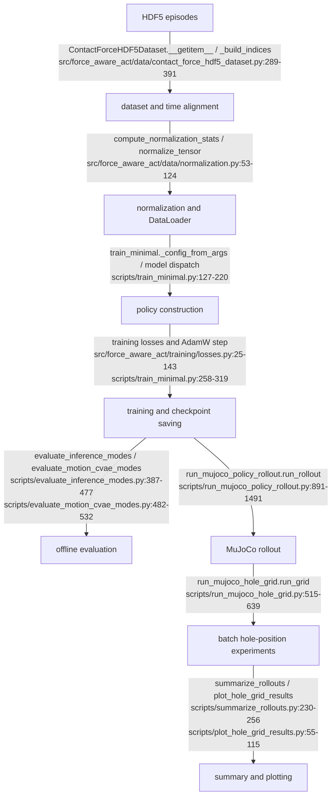

# ForceAwareACT Codebase Architecture Audit

> Current-status note (2026-07-07): this is a historical architecture audit that predates the current canonical documentation set and does not fully cover the `force_aware_contact_cvae` policy family. For the current source-of-truth audit, see `docs/REPOSITORY_ARCHITECTURE_AUDIT.md`, `docs/ARCHITECTURE.md`, `docs/SCRIPTS_REFERENCE.md`, and `docs/TESTING.md`. Historical experiment observations below are preserved.

Generated from a read-only audit of `/Users/wangshuteng/Desktop/ForceAwareACT`.

## 1. Executive Summary

ForceAwareACT is a PyTorch research codebase for HDF5 demonstration training, offline latent-mode evaluation, and guarded MuJoCo rollouts for peg-in-hole insertion. The implemented path is:



Current policy families are:

- `force_aware_act`: full dual-latent model with online force, force-vision fusion, motion posterior, contact posterior, and contact conditional prior. Source: `ForceAwareACTPolicy` in `src/force_aware_act/models/policy.py:49-285`.
- `force_aware_motion_cvae`: contact-latent-free Motion-CVAE with the same online force/fusion path and motion posterior only. Source: `ForceAwareACTMotionCVAEPolicy` in `src/force_aware_act/models/force_aware_motion_cvae_policy.py:18-299`.
- `act_baseline`: structurally force-free ACT-style baseline with RGB, qpos, zero motion token, and action head only. Source: `ACTPolicyBaseline` in `src/force_aware_act/models/act_policy.py:15-130`.

The code already supports the next Motion-CVAE rollout checkpoint in the single rollout and grid/LHS runners because checkpoint dispatch reads `config.policy_variant` and instantiates `ForceAwareACTMotionCVAEPolicy` (`scripts/run_mujoco_policy_rollout.py:192-206`). However, the current LHS runner cannot load an existing manifest or task point CSV; it only regenerates points from `--sampling-mode`, bounds, and `--base-seed` (`scripts/run_mujoco_hole_grid.py:94-185`). Since the local repository does not contain the prior `outputs/peg_hole_100/hole_lhs_50_xz_2mm_mid_dq002` manifest/task-points files, exact point reuse is not locally verifiable from output artifacts.

## 2. Repository Tree Overview

Important source areas:

- `src/force_aware_act/data/`: HDF5 dataset, normalization, and exports.
- `src/force_aware_act/models/`: vision, force, posterior/prior encoders, policies, heads, and attention modules.
- `src/force_aware_act/training/`: loss functions.
- `src/force_aware_act/utils/`: episode-list resolution.
- `scripts/`: training, normalization, offline evaluation, rollout, grid/LHS, plotting, inspection, and audit utilities.
- `tests/`: unit/integration tests for models, training compatibility, evaluators, rollout utilities, hole grid, and summaries.
- `docs/`: experiment reports and design/audit notes.

Executable scripts under `scripts/`:

| Script | Purpose | Main policy variants | Main inputs | Main outputs | Calls/wraps | Status / relevance |
|---|---|---|---|---|---|---|
| `analyze_contact_latent.py` | Analyze posterior contact latents | `force_aware_act` | checkpoint, HDF5 | CSV/metrics | model/data | Legacy contact analysis |
| `analyze_contact_stage.py` | Contact-stage behavior from rollouts/demos | rollout logs/HDF5 | CSV/report | none | Diagnostic |
| `analyze_train_log.py` | Training CSV analysis | any logged training | CSV | printed summaries | none | Utility |
| `audit_hdf5_replay_task_error.py` | Replay HDF5 joint states to audit task error | data only | HDF5/XML | summaries | MuJoCo | Diagnostic |
| `audit_model_components.py` | Parameter-count component audit | model classes | none/checkpoint | printed counts | models | Diagnostic |
| `compute_normalization_stats.py` | Compute stats | all dataset policies | episode list/HDF5 | `.pt` stats | dataset/normalization | Current |
| `debug_inference_modes.py` | One-batch contact-mode debug | `force_aware_act` | HDF5/checkpoint/stats | printed metrics | dataset/model | Legacy contact |
| `debug_one_batch.py` | One-batch policy smoke | `force_aware_act` | HDF5 | printed shapes | dataset/model | Diagnostic |
| `evaluate_inference_modes.py` | Offline contact zero/prior/posterior evaluation | `force_aware_act`, limited ACT baseline | HDF5/checkpoint/stats | batch CSV, best/worst CSV | dataset/model | Legacy contact evaluator |
| `evaluate_motion_cvae_modes.py` | Motion-CVAE zero vs posterior mean/sample | `force_aware_motion_cvae` | HDF5/checkpoint/stats | per-sample CSV/summary | dataset/model | Current Motion-CVAE evaluator |
| `forceact_eta.py` | ETA wrapper around subprocess output | training commands | subprocess | ETA output | subprocess | Utility |
| `inspect_action_modes.py` | Inspect action label modes | dataset | HDF5 | printed samples | dataset | Data audit |
| `inspect_episode_collection.py` | Inspect collection lengths/fields | dataset | episode list | printed/CSV | dataset | Data audit |
| `inspect_hole_assembly.py` | Validate MuJoCo hole body/site offset | XML | XML args | printed geometry | rollout hole helpers | Current geometry safety |
| `inspect_inference_case_predictions.py` | Inspect one evaluated case | contact model | HDF5/checkpoint | printed chunks | evaluator/model | Legacy contact debug |
| `inspect_real_hdf5.py` | Read-only HDF5 inspector | data only | HDF5 | printed fields | h5py | Data audit |
| `inspect_worst_case_episode.py` | Inspect signals/cameras around worst case | HDF5/eval row | HDF5/CSV | plots/frames | dataset | Diagnostic |
| `plot_hole_grid_results.py` | Plot grid/LHS summaries | rollout summaries | `grid_summary.csv` | PNG/PDF/CSV/JSON | pandas/matplotlib | Current |
| `plot_rollout_sensor_analysis.py` | Plot rollout sensor/task traces | rollout CSV | plots | matplotlib | Diagnostic |
| `probe_arm_teleop_mujoco_env.py` | Probe MuJoCo env | XML | JSON | MuJoCo | Diagnostic |
| `probe_joint_command_convention.py` | Probe public/internal joint convention | XML | JSON | MuJoCo | Diagnostic |
| `replay_hdf5_joint_trajectory_mujoco.py` | Replay recorded commands/joints | HDF5/XML | CSV/videos | MuJoCo | Diagnostic |
| `run_mujoco_hole_grid.py` | Grid/random/LHS rollout batch runner | all rollout-supported checkpoints | checkpoint/stats/XML | manifest, task CSV, summaries | `run_mujoco_policy_rollout.py`, summaries/plots | Current experiment runner |
| `run_mujoco_policy_rollout.py` | Single guarded rollout | all three policy families by checkpoint | checkpoint/stats/XML | rollout CSV, summary JSON, videos | model/data utils | Current deployment evaluator |
| `run_peg_fixed_insert_100_experiment.sh` | Fixed-insert 100-episode train/eval/rollout wrapper | original dual-latent | data/checkpoints | splits/stats/checkpoints/evals/rollouts | train/eval/rollout scripts | Legacy/current wrapper for dual-latent |
| `run_policy_inference_smoke.py` | One sample deployable inference smoke | `force_aware_act` | HDF5/checkpoint/stats | printed output | dataset/model | Diagnostic |
| `script_utils.py` | Compatibility re-export for path helpers | none | none | none | `force_aware_act.utils` | Utility |
| `summarize_rollouts.py` | Aggregate rollout dirs | any rollout summaries | rollout root | summary CSV | rollout logs/summaries | Current |
| `train_act_baseline.py` | Train ACT baseline | `act_baseline` | HDF5/stats | checkpoint/log | dataset/model/loss | Current baseline |
| `train_contact_prior_stage2.py` | Stage-2 contact-prior distillation | `force_aware_act` | stage-1 checkpoint/HDF5/stats | checkpoint/log | ForceAwareACT | Legacy dual-latent stage 2 |
| `train_minimal.py` | Train ForceAwareACT or Motion-CVAE | `force_aware_act`, `force_aware_motion_cvae` | HDF5/stats | checkpoint/log | dataset/model/loss | Current main trainer |

## 3. Policy Inventory

### `force_aware_act`

- CLI name: `force_aware_act` in `scripts/train_minimal.py:44-46`.
- Class/source: `ForceAwareACTPolicy`, `src/force_aware_act/models/policy.py:49-354`.
- Constructor: `d_model`, `z_dim`, `q_dim`, `action_dim`, `force_dim`, `chunk_len`, transformer dimensions, ResNet flags, `max_force_window_len` (`policy.py:49-74`).
- Forward API: `forward(images, qpos, force_window, action_chunk=None, future_force_chunk=None, is_training=True, contact_latent_mode=None, deterministic_prior=True) -> Dict[str, Any]` (`policy.py:159-169`).
- Inputs/shapes: images `[B,N_cam,3,H,W]`, qpos `[B,7]`, force window `[B,T,6]`, action chunk `[B,K,7]`, future force chunk `[B,K,6]` validated in `policy.py:287-354`.
- Outputs: `pred_action [B,K,7]`, `pred_force [B,K,6]`, `z_motion [B,z]`, `z_contact [B,z]`, posterior/prior means/logvars as available (`policy.py:255-263`).
- Token sequence: visual spatial tokens, force-vision fused token `z_VF`, qpos token `z_q`, online force token `z_F_online`, motion latent token, contact latent token (`policy.py:176-187`, `266-285`).
- Training latent behavior: motion posterior from qpos and future action; contact posterior from qpos, future action, and future force; contact prior also computed from online features (`policy.py:189-213`).
- Deployment latent behavior: motion is exactly zero; contact is either zero or deterministic/stochastic conditional prior depending `contact_latent_mode` (`policy.py:217-240`).
- Heads: `ActionHead` and `ForceHead`; force head also receives force/contact auxiliary dict (`policy.py:245-253`).
- Losses: action L1, force L1, `kl_motion`, `kl_contact`, optional `loss_prior` (`src/force_aware_act/training/losses.py:25-87`).
- Rollout support: yes, contact mode `zero`/`prior` (`scripts/run_mujoco_policy_rollout.py:572-600`).
- Offline evaluator support: legacy contact evaluator (`scripts/evaluate_inference_modes.py:162-240`).

### `force_aware_motion_cvae`

- CLI name: `force_aware_motion_cvae` in `scripts/train_minimal.py:44-46`.
- Class/source: `ForceAwareACTMotionCVAEPolicy`, `src/force_aware_act/models/force_aware_motion_cvae_policy.py:18-299`.
- Constructor: same core dimensions as full policy, minus contact modules (`force_aware_motion_cvae_policy.py:37-52`).
- Forward API: `forward(images, qpos, force_window, action_chunk=None, future_force_chunk=None, is_training=True, motion_latent_override=None) -> Dict[str, Any]` (`force_aware_motion_cvae_policy.py:135-144`).
- Inputs/shapes: same online inputs; future force is accepted for API symmetry but not used by the latent (`force_aware_motion_cvae_policy.py:135-170`).
- Outputs: `pred_action [B,K,7]`, `pred_force [B,K,6]`, `z_motion [B,z]`, and `mu_motion/logvar_motion` during training (`force_aware_motion_cvae_policy.py:185-197`).
- Token sequence: visual spatial tokens, `z_VF`, `z_q`, `z_F_online`, motion latent token; no contact token (`force_aware_motion_cvae_policy.py:148-183`).
- Training latent behavior: posterior sample from `encode_motion_posterior(qpos, action_chunk)` (`force_aware_motion_cvae_policy.py:161-170`, `199-210`).
- Deployment latent behavior: zero unless `motion_latent_override` is provided; rollout uses the default zero branch (`force_aware_motion_cvae_policy.py:171-175`; `scripts/run_mujoco_policy_rollout.py:582-590`).
- Offline evaluator support: dedicated zero/posterior mean/sample evaluator (`scripts/evaluate_motion_cvae_modes.py:254-301`).
- Losses: action L1 + force L1 + `beta_motion * kl_motion`; no contact KL or prior loss (`src/force_aware_act/training/losses.py:110-143`).

### `act_baseline`

- CLI/checkpoint name: `act_baseline` from `scripts/train_act_baseline.py:110-134`.
- Class/source: `ACTPolicyBaseline`, `src/force_aware_act/models/act_policy.py:15-130`.
- Forward API: `forward(images, qpos) -> Dict[str, Any]` (`act_policy.py:92-117`).
- Inputs/shapes: images `[B,N_cam,3,H,W]`, qpos `[B,7]`; no force input.
- Outputs: `pred_action [B,K,7]`, `z_motion` zero token, `decoder_hidden`; no force output (`act_policy.py:112-117`).
- Training/deployment latent behavior: always zero motion token; no posterior.
- Loss: action L1 only (`src/force_aware_act/training/losses.py:90-107`).
- Rollout support: yes via checkpoint dispatch, with NaN force predictions for logging (`scripts/run_mujoco_policy_rollout.py:199-206`, `603-617`).

## 4. Data Pipeline

`ContactForceHDF5Dataset` is the central dataset (`src/force_aware_act/data/contact_force_hdf5_dataset.py:235-366`). HDF5 fields used include:

- State timestamps: `timestamps/state_episode` or `timestamps/state`; image timestamps: `timestamps/image_episode` or `timestamps/image`; force timestamps: `timestamps/force_episode` or `timestamps/force` (`contact_force_hdf5_dataset.py:61-63`).
- State: `observations/joint_pos`, `observations/joint_vel`, `observations/joint_torque`, `observations/ee_pose` (`contact_force_hdf5_dataset.py:307-315`).
- Force: `observations/ft_wrench` (`contact_force_hdf5_dataset.py:336-351`).
- Actions by mode: `observations/joint_pos`, `action`, `actions/joint_pos_command`; delta modes subtract current qpos (`contact_force_hdf5_dataset.py:64-70`, `462-486`).
- Images: `observations/images/{camera}` in the order supplied by `camera_names` (`contact_force_hdf5_dataset.py:393-427`).

Time alignment:

- For each state timestamp, the image index is nearest by `nearest_index` (`contact_force_hdf5_dataset.py:37-55`, `307`).
- Historical force window uses linearly spaced times over `[t_state - duration, t_state]`; for each target time it chooses the most recent force sample using `searchsorted(..., side="right") - 1`, clipped to valid bounds (`contact_force_hdf5_dataset.py:201-224`).
- Future force chunk samples future state indices and maps their state times to nearest force timestamps (`contact_force_hdf5_dataset.py:336-351`).
- Future action chunk starts at `state_index + action_offset`; `joint_pos` uses offset 1, command/action modes use offset 0 (`contact_force_hdf5_dataset.py:270-280`, `462-486`).
- There is no variable padding near episode end; `_build_indices` only emits indices with enough future action length: `range(min(n_state, action_len) - chunk_len - action_offset)` (`contact_force_hdf5_dataset.py:368-391`).

Returned item keys include `images [N_cam,3,H,W]`, `qpos [7]`, `qvel [7]`, `joint_torque [7]`, `ee_pose`, `action_chunk [K,7]`, `episode_path`, `state_index`, `t_state`, `image_index`, plus `force_window [T,6]`, `future_force_chunk [K,6]`, `force_indices` when `include_force=True` (`contact_force_hdf5_dataset.py:289-366`). Episode paths and state indices are exposed; no separate episode identifier field exists.

Sample count is entirely determined by `_build_indices` (`contact_force_hdf5_dataset.py:368-391`). For the 100-episode command-action dataset mentioned in current experiments, the expected approximately `29,977` samples are the sum over every episode of `min(n_state, action_len) - chunk_len - action_offset` for the selected `action_mode`, after safe-length validation. The older fixed-insert wrapper expected `35,117` samples for a different joint-position 100-episode set (`scripts/run_peg_fixed_insert_100_experiment.sh:105-116`).

Episode-list resolution preserves list order and resolves relative paths first against project root, then list parent (`src/force_aware_act/utils/episode_paths.py:46-78`).

## 5. Normalization Pipeline

Normalization stats are computed by `scripts/compute_normalization_stats.py:35-76` using `ContactForceHDF5Dataset` and `compute_normalization_stats` (`src/force_aware_act/data/normalization.py:86-102`). Running stats are mean/std with variance clamped by `eps` (`normalization.py:21-50`). Fields:

- qpos stats from `qpos`.
- action stats from `action_chunk`.
- force stats from both `force_window` and `future_force_chunk` (`normalization.py:53-83`).
- Images are normalized in the dataset by dividing by 255, optional ImageNet normalization (`contact_force_hdf5_dataset.py:393-427`).

Stats are serialized with `torch.save`, including metadata such as action mode, chunk/window lengths, camera names, image size, and episode paths (`scripts/compute_normalization_stats.py:53-68`). Training, offline evaluation, and rollout all load `qpos_mean/std`, `action_mean/std`, `force_mean/std`; action-mode mismatch is checked in rollout and evaluators (`scripts/run_mujoco_policy_rollout.py:138-168`; `scripts/evaluate_motion_cvae_modes.py:83-104`; `scripts/evaluate_inference_modes.py:64-85`). Rollout denormalizes predicted actions and predicted forces before execution/logging (`scripts/run_mujoco_policy_rollout.py:603-617`).

Potential mismatch: dataset force labels come from recorded `observations/ft_wrench`; rollout force comes from MuJoCo sensors `force_ee` and `torque_ee` (`scripts/run_mujoco_policy_rollout.py:914-927`, `1016-1018`). The audit found no bias removal, gravity compensation, filtering, or coordinate-frame conversion in rollout. Therefore HDF5 force targets and rollout `force_norm` should not be assumed physically identical without verifying the recorder's wrench convention.

## 6. Training Pipeline

`scripts/train_minimal.py` trains `force_aware_act` and `force_aware_motion_cvae` (`train_minimal.py:44-46`). It builds config from args (`train_minimal.py:127-168`), dataset via `ContactForceHDF5Dataset` (`train_minimal.py:171-181`), DataLoader with `shuffle=True` (`train_minimal.py:196-199`), model dispatch (`train_minimal.py:202-219`), and AdamW (`train_minimal.py:220`). A training step normalizes batch tensors, applies linear beta warmup (`src/force_aware_act/training/losses.py:188-195`), runs the selected policy, computes the variant-specific loss, backprops, steps, and logs CSV (`train_minimal.py:258-319`). Checkpoint is saved once at the end with `model_state_dict`, `optimizer_state_dict`, `config`, and `step` (`train_minimal.py:365-372`).

`train_latent_mode` only affects the full ForceAwareACT branch by passing `contact_latent_mode=args.train_latent_mode` (`train_minimal.py:285-295`); it does not change Motion-CVAE training, which always uses the motion posterior when `is_training=True` (`force_aware_motion_cvae_policy.py:161-170`). No resume path or intermediate checkpoint saving is implemented in `train_minimal.py`.

`scripts/train_act_baseline.py` builds `ContactForceHDF5Dataset(..., include_force=False)`, trains `ACTPolicyBaseline`, computes action L1, and saves the same checkpoint envelope (`scripts/train_act_baseline.py:137-246`).

`scripts/train_contact_prior_stage2.py` is full ForceAwareACT-only. It loads a prior checkpoint, freezes every parameter except names starting with `contact_prior.`, trains only the contact prior against posterior targets, and logs prior metrics (`train_contact_prior_stage2.py:99-143`, `167-280`).

Loss definitions:

- `loss_action`: L1 between `pred_action` and action chunk.
- `loss_force`: L1 between `pred_force` and future force chunk.
- `kl_motion`: diagonal Gaussian KL from `mu_motion/logvar_motion` to standard normal.
- `kl_contact`: same for contact posterior.
- `loss_prior`: optional contact-prior distillation (`src/force_aware_act/training/losses.py:25-185`).
- For Motion-CVAE, contact KL and prior loss are absent (`losses.py:110-143`).

## 7. Checkpoint Format and Dispatch

Primary training checkpoints are dictionaries:

```text
model_state_dict
optimizer_state_dict
config
step
```

This is written by `train_minimal.py:365-372`, `train_act_baseline.py:237-244`, and the same envelope is used in stage-2 contact-prior training. `config.policy_variant` selects the model. Rollout dispatch reads it with default fallback `"force_aware_act"` (`scripts/run_mujoco_policy_rollout.py:192-206`). Offline Motion-CVAE evaluation supports both raw state dicts and dict checkpoints, but requires/resolves variant `force_aware_motion_cvae` and loads strictly by default (`scripts/evaluate_motion_cvae_modes.py:155-230`).

Compatibility risks:

- Model construction logic is duplicated across training, rollout, and evaluators.
- Raw state-dict fallback exists in Motion-CVAE evaluator but not in rollout or legacy evaluator.
- Older checkpoints without `config.policy_variant` are treated as `force_aware_act`.
- Motion-CVAE rollout still accepts the CLI name `--contact-latent-mode`, but it is ignored for the Motion-CVAE branch (`scripts/run_mujoco_policy_rollout.py:582-590`).

## 8. Offline Evaluation Pipeline

`scripts/evaluate_inference_modes.py` compares contact zero/prior/posterior for the full policy. It runs three forwards: zero deployable, prior deployable deterministic, and posterior oracle with future action/force labels (`evaluate_inference_modes.py:162-240`). It aggregates by batch, writes a batch-level CSV, and optionally writes ranked per-sample best/worst cases (`evaluate_inference_modes.py:287-360`, `387-477`). It is not suitable for Motion-CVAE because its metrics are contact-prior centric; ACT baseline support fills contact metrics with NaNs (`evaluate_inference_modes.py:243-272`).

`scripts/evaluate_motion_cvae_modes.py` is Motion-CVAE-specific. It:

- Loads dataset with `shuffle=False`.
- Runs zero inference without future labels.
- Encodes posterior via `model.encode_motion_posterior(qpos, action_chunk)`.
- Uses `mu_motion` by default or a sample when `--posterior-mode sample`.
- Runs posterior inference via `motion_latent_override`.
- Computes per-sample L1, zero/posterior prediction difference, KL, and latent stats.

Core implementation is `run_motion_modes` (`evaluate_motion_cvae_modes.py:254-301`), metric helpers (`304-378`), CSV row construction (`381-415`), aggregation (`418-436`), and evaluation loop (`482-532`). KL reduction is latent-dimension sum per sample, then sample mean during aggregation, matching the usual training `kl_normal` convention used in losses (`src/force_aware_act/training/losses.py:25-143`).

Metric meanings:

- `action_l1_zero`: per-sample mean absolute `pred_action_zero - action_chunk`.
- `action_l1_posterior`: same for posterior latent.
- `force_l1_zero` / `force_l1_posterior`: same for future force.
- `pred_action_zero_posterior_mean_abs_diff`: mean absolute difference between the two action predictions.
- `kl_motion`: `-0.5 * sum(1 + logvar - mu^2 - exp(logvar))` per sample.
- `mu_motion_l2`: L2 norm of each latent mean vector.
- `posterior_std_mean`: mean of `exp(0.5 * logvar_motion)`.

Metadata caveat: dataset exposes `episode_path`, `state_index`, and `t_state`; the Motion-CVAE evaluator's `episode_identifier` is `Path(episode_path).stem` (`evaluate_motion_cvae_modes.py:381-415`). For `<episode_directory>/episode.hdf5`, this becomes `episode` for every row, so it does not uniquely identify episodes.

## 9. Single-Rollout Pipeline

`scripts/run_mujoco_policy_rollout.py` parses rollout CLI (`1626-1683`), validates paths/args (`1686-1755`), loads stats/checkpoint, dispatches policy (`891-903`), loads MuJoCo XML, resolves joints/actuators/cameras/sensors/sites/bodies (`905-927`), resets initial joint state, applies hole offset, and then loops for `max_rollout_steps` (`929-1394`).

One rollout iteration:

1. Read qpos, qvel, and wrench from MuJoCo sensors (`1013-1018`).
2. Compute translational `force_norm = norm(wrench[:3])` (`1016-1018`).
3. Resample historical force window from force history by interpolation (`548-569`, `1019-1024`).
4. Render cameras and preprocess to policy image tensor (`1025-1031`).
5. Compute task diagnostics from peg-tip and hole-goal sites (`463-494`, `1032-1035`).
6. Update success hold counter (`1039-1055`).
7. Normalize qpos and force window (`1056-1063`).
8. Run policy (`572-600`, `1065-1068`).
9. Denormalize action/force predictions (`603-617`, `1068`).
10. Select action chunk element or temporal aggregate (`1102-1134`).
11. Optionally add axial-push joint bias (`1135-1159`).
12. Interpret action mode, clip per-joint delta by `max_delta_q`, apply EMA, clip actuator range, and set `data.ctrl` (`1160-1205`).
13. Log row fields and step physics for `physics_steps_per_policy` (`1215-1394`).

Summary JSON includes checkpoint, policy variant, action selection, success thresholds, final/min distances, force stats, force-above-threshold counts, videos, and hole offset metadata (`1405-1491`).

## 10. Action Chunk Execution

Implemented modes (`scripts/run_mujoco_policy_rollout.py:668-697`):

- `first`: select index 0.
- `mid`: select `chunk_len // 2`.
- `last`: select `chunk_len - 1`.
- `temporal`: each policy step predicts a fresh chunk; old chunks are retained while their age is `< K`; for current step, choose each stored chunk's age-aligned action and average with weights `exp(-decay * age)`. Since weight decreases with age, newer predictions get higher weight when `decay > 0`.

EMA and clipping order:

1. Convert selected raw action to target qpos depending action mode (`640-655`, `1160`).
2. Add axial-push bias if enabled (`1161`).
3. Per-joint clip `target_ctrl_with_bias - qpos` to `[-max_delta_q, +max_delta_q]` (`1185-1190`).
4. EMA: `ema_alpha * delta_clipped_action + (1 - ema_alpha) * previous_command` (`1191-1194`).
5. Clip to actuator ctrlrange (`1195-1199`).

Logged fields:

- `action_chunk_delta_norm_0/mid/last`: norm from current qpos to first/mid/last target-qpos chunk elements (`620-637`).
- `action_chunk_path_length`: sum of adjacent chunk target deltas (`624-627`).
- `action_chunk_first_to_last_delta`: norm between last and first chunk targets (`634-636`).
- `action_delta_norm_raw_to_current`, `...after_clip`, `...after_ema`: vector norms before/after per-joint clip and EMA (`1223-1231`).
- `temporal_mean_age` and `temporal_num_predictions`: weighted average prediction age and number of contributing chunks (`680-697`, `1232-1233`).

## 11. Force and Safety Logic

Rollout reads force and torque sensors by name, concatenating 3D force and 3D torque into wrench (`scripts/run_mujoco_policy_rollout.py:914-927`, `426-430`). `force_norm`, `max_force_norm`, and `mean_force_norm` use only `Fx,Fy,Fz` (`1016-1018`, `1408-1411`). No filtering, bias removal, gravity compensation, or sustained-force requirement is implemented.

Hard force stop:

- CLI default in single rollout: `--force-stop-threshold 300.0` (`run_mujoco_policy_rollout.py:1655`).
- CLI default in grid runner: `1000.0` (`scripts/run_mujoco_hole_grid.py:699-701`).
- Trigger: one policy-step sample where `force_norm > threshold` (`run_mujoco_policy_rollout.py:1081-1085`).

Success force threshold is separate from hard stop:

- Default `success_force_threshold=80.0` (`run_mujoco_policy_rollout.py:1656-1659`; `run_mujoco_hole_grid.py:709-712`).
- It is used only inside success condition, not as a hard stop.
- Older experiments can log 40-80+ N without stopping if hard stop is higher; summary counts `force_gt_20_steps` and `force_gt_40_steps` (`run_mujoco_policy_rollout.py:1466-1468`).

## 12. Success Criteria

Success is:

```text
peg_to_hole_dist < success_distance_threshold
and peg_to_hole_lateral_error < success_lateral_threshold
and force_norm < success_force_threshold
held for success_hold_steps consecutive policy iterations
```

Implementation: `_success_condition` (`scripts/run_mujoco_policy_rollout.py:847-862`) and `_update_success_hold_counter` (`865-869`), called at `1039-1055`. Defaults: distance `0.005` m, lateral `0.006` m, force `80` N, hold `15` policy steps, success-stop enabled unless `--disable-success-stop` (`1626-1660`, `1710-1718`).

Task diagnostics use `peg_tip_site` and `hole_goal_site` positions. `peg_to_hole = hole_center - peg_tip`, axial error is dot product with normalized `hole_axis_world`, and lateral is the residual vector norm (`run_mujoco_policy_rollout.py:463-494`, `1740-1745`). There is no direct insertion-depth/contact-state check beyond these geometric and force predicates. The reported condition `distance < 5 mm`, `lateral < 6 mm`, `force < 80 N`, held 15 policy steps is exactly supported by defaults.

## 13. Hole Offset Implementation

The rollout defaults to `hole_goal_site` and `wall_task` (`scripts/run_mujoco_policy_rollout.py:35-37`). It resolves and validates that the site and expected hole geoms are inside the selected body subtree (`276-339`). Offset arguments are meters (`--hole-offset-x/y/z`), and `0.002` means 2 mm.

`apply_hole_body_offset` moves `model.body_pos[body_id]` by either:

- `world` frame: transforms requested world delta into parent-local coordinates and expects the site's world displacement to equal the requested offset.
- `body` frame: applies the offset in parent/body-local coordinates and computes expected world displacement from parent rotation.

It calls `mj_forward`, records nominal/actual body local and site world positions, computes actual offset, and raises if validation error norm exceeds `1e-7` (`run_mujoco_policy_rollout.py:343-415`). Because `wall_task` owns the site and hole collision geoms per docs (`docs/HOLE_POSITION_ROBUSTNESS_EVALUATION.md:21-38`), the whole wall/hole assembly moves together, not only the goal site.

## 14. Batch/Grid/LHS Experiment System

`scripts/run_mujoco_hole_grid.py` supports:

- `grid`: Cartesian product of comma-separated x offsets and z offsets, repeats supported (`144-163`).
- `random`: uniform independent x/z samples (`118-129`, `166-167`).
- `latin_hypercube`: paired x/z LHS samples using `np.random.default_rng(seed)`, random stratum positions, independent shuffles of x and z strata, and zip pairing (`94-109`, `168-185`).

Defaults are 50 points, x/z range `[-0.002, 0.002]`, y `0`, base seed `0`, action mode `action`, action select `mid`, max rollout steps `900`, max delta q `0.02`, hard force stop `1000`, success thresholds 5 mm / 6 mm / 80 N / 15 steps (`run_mujoco_hole_grid.py:677-725`).

For each point, it builds a child command for `run_mujoco_policy_rollout.py`, always adding `--execute-actions`; it appends `--save-videos` only if requested (`426-486`). It stores `task_points.csv`, `grid_manifest.json`, per-run output directories, child commands, return codes, and statuses (`515-639`). There is no subprocess timeout argument; `subprocess.run` is called without `timeout` (`617`). There is no retry loop. `--continue-on-error` continues after process errors; `--skip-existing` skips a run only when its `summary.json` already exists (`603-626`). Final counts and Wilson CI are printed (`642-674`), and `random_position_summary.json` includes completion, success, process-error, safe-success, z/x sign, quadrant, and radial-bin stats (`381-423`).

`plot_hole_grid_results.py` reads `grid_summary.csv`, coerces numeric fields, computes success/safe-success booleans, aggregates by x/z, and writes heatmaps/scatter/group plots (`plot_hole_grid_results.py:55-115`, `239-350`).

## 15. Previous 50-Point LHS Experiment Reconstruction

Local search covered `docs`, `scripts`, and `outputs` for the facts `50 planned`, `48 completed`, `27 successes`, `2 process errors`, `56.25%`, `1.627`, `1.813`, `0.450`, `lhs`, `latin_hypercube`, `process_error`, `temporal_agg_decay`, and related terms. No local `grid_manifest.json`, `task_points.csv`, `grid_summary.csv`, or `random_position_summary.json` for the named prior experiment exists in the Mac working tree.

Evidence found:

- Documentation specifies the intended 50-point LHS run at `outputs/peg_hole_100/hole_lhs_50_xz_2mm_mid_dq002` with seed `20260702`, checkpoint `outputs/peg_hole_100/action_trainzero_all100_20k_bs16/checkpoint.pt`, action mode `action`, action selection `mid`, `max_delta_q=0.02`, hard force stop `1000`, max rollout steps `900`, success thresholds 5 mm / 6 mm / 80 N / 15 steps, no videos in first run, and `--continue-on-error` (`docs/HOLE_POSITION_ROBUSTNESS_EVALUATION.md:136-203`).
- `run_mujoco_hole_grid.py` deterministically regenerates LHS points from seed/bounds (`scripts/run_mujoco_hole_grid.py:94-109`).
- The exact 50 coordinates are not stored locally and were not regenerated in this audit because the task prohibited generating a new LHS point set.
- The two process errors and exact per-run commands cannot be reconstructed locally without the missing manifest.
- Failed processes can be resumed only by rerunning the same generation command with `--skip-existing` if completed run directories contain readable `summary.json` (`run_mujoco_hole_grid.py:603-608`); this does not load a prior explicit point file.

## 16. Exact Supported Command for Motion-CVAE 20k Same-Protocol Run

Existing scripts can run a deterministic LHS protocol with the same seed and bounds, and rollout dispatch will load a `force_aware_motion_cvae` checkpoint. Existing scripts cannot safely guarantee the exact same point list and point IDs unless either the original manifest/task CSV exists or one trusts regeneration from the documented seed and unchanged code. There is no CLI to load an existing task point CSV or manifest.

Supported command that regenerates from the documented seed and current code:

```bash
cd ~/ForceAwareACT_workspace/ForceAwareACT
conda activate forceact

PYTHONPATH=src python scripts/run_mujoco_hole_grid.py \
  --sampling-mode latin_hypercube \
  --num-points 50 \
  --x-min -0.002 \
  --x-max 0.002 \
  --z-min -0.002 \
  --z-max 0.002 \
  --base-seed 20260702 \
  --checkpoint outputs/peg_hole_100/forceaware_motion_cvae_betam5e4_fromscratch20k/checkpoint.pt \
  --normalization-stats outputs/peg_hole_100/normalization_stats_action_all100.pt \
  --model-xml ../arm_teleop/model/pangu_all_right.xml \
  --contact-latent-mode zero \
  --action-mode action \
  --action-select-mode temporal \
  --chunk-len 10 \
  --force-window-len 20 \
  --force-window-duration 0.25 \
  --policy-rate-hz 30 \
  --max-rollout-steps 900 \
  --max-delta-q 0.02 \
  --force-stop-threshold 1000 \
  --hole-axis-world 0 -1 0 \
  --hole-site-name hole_goal_site \
  --hole-body-name wall_task \
  --hole-offset-frame world \
  --y-offset 0 \
  --success-distance-threshold 0.005 \
  --success-lateral-threshold 0.006 \
  --success-force-threshold 80 \
  --success-hold-steps 15 \
  --output-root outputs/peg_hole_100/hole_lhs_50_xz_2mm_motion_cvae20k_temporal_d03_dq002 \
  --continue-on-error \
  --no-plot-results
```

Important limitation: `run_mujoco_hole_grid.py` does not forward `--temporal-agg-decay` to rollout (`scripts/run_mujoco_hole_grid.py:426-486`), but rollout default is already `0.3` (`scripts/run_mujoco_policy_rollout.py:1642`). The smallest code change for strict reproducibility would be adding `--task-points-csv` or `--manifest` loading and forwarding `--temporal-agg-decay` explicitly; this audit did not implement it.

## 17. Paired-Comparison Plan

Existing outputs can be summarized individually with `run_mujoco_hole_grid.py` outputs and `summarize_rollouts.py`, but no script currently performs paired old/new classification by `point_index`. Required new comparison logic should join old and new `grid_summary.csv` or manifests by `point_index` and/or exact `(hole_offset_x, hole_offset_z)` and classify:

- old success / new success
- old failure / new success
- old success / new failure
- old failure / new failure
- old process error
- new process error

Existing metrics available from grid summaries include success, safe success, final distance/lateral/axial, max/mean force, `force_gt_20_steps`, `force_gt_40_steps`, success time, quadrant, and radial bins (`scripts/run_mujoco_hole_grid.py:281-423`). `time above 20 N/40 N` can be approximated as step counts divided by policy rate if policy rate is known; exact duration above threshold is not already written as seconds. Contact recovery indicators are not explicitly implemented and would require new definitions from rollout logs.

## 18. Critical Code and Experiment Risks

Critical for experimental validity:

- Exact LHS point reuse is not guaranteed from local artifacts because the original manifest/task point CSV is missing and the runner has no manifest-loading mode.
- `episode_identifier` in Motion-CVAE evaluator collapses `<episode_dir>/episode.hdf5` to `episode`, losing uniqueness.
- Dataset HDF5 wrench targets and rollout MuJoCo sensor force norms are not proven equivalent; rollout has no bias/filter/gravity compensation.
- `run_mujoco_hole_grid.py` cannot explicitly set `temporal_agg_decay`; it relies on rollout default 0.3.

Important but not blocking:

- Model/checkpoint construction is duplicated across train/eval/rollout scripts.
- Motion-CVAE rollout still exposes `--contact-latent-mode`, which is ignored for that policy.
- No training resume or intermediate checkpoint save path in main training.
- Batch runner has no subprocess timeout or retry.
- Summary fallback from old `rollout_log.csv` infers success using hard-coded hold counter `>=15` (`scripts/summarize_rollouts.py:176-183`).

Minor cleanup:

- Legacy contact evaluators produce NaNs for ACT baseline contact metrics.
- Several reports mention capabilities or exact experiments whose output artifacts are not present locally.
- Script purposes overlap among debug/evaluation/inspection utilities.

## 19. Recommended Next Operational Step

Before running the Motion-CVAE 20k 50-point paired experiment, copy or locate the original Linux `grid_manifest.json` and `task_points.csv` for `outputs/peg_hole_100/hole_lhs_50_xz_2mm_mid_dq002`. If unavailable, either accept deterministic regeneration from seed `20260702` and unchanged NumPy/code, or make the smallest runner change to load an explicit point CSV/manifest and forward `--temporal-agg-decay`.

## 20. Files Inspected

Primary inspected files:

- `CODEX_RULES.md`
- `pyproject.toml`
- `README.md`
- `src/force_aware_act/data/contact_force_hdf5_dataset.py`
- `src/force_aware_act/data/normalization.py`
- `src/force_aware_act/models/policy.py`
- `src/force_aware_act/models/force_aware_motion_cvae_policy.py`
- `src/force_aware_act/models/act_policy.py`
- `src/force_aware_act/training/losses.py`
- `src/force_aware_act/utils/episode_paths.py`
- `scripts/train_minimal.py`
- `scripts/train_act_baseline.py`
- `scripts/train_contact_prior_stage2.py`
- `scripts/compute_normalization_stats.py`
- `scripts/evaluate_inference_modes.py`
- `scripts/evaluate_motion_cvae_modes.py`
- `scripts/debug_inference_modes.py`
- `scripts/run_mujoco_policy_rollout.py`
- `scripts/run_mujoco_hole_grid.py`
- `scripts/summarize_rollouts.py`
- `scripts/plot_hole_grid_results.py`
- `scripts/run_peg_fixed_insert_100_experiment.sh`
- `docs/HOLE_POSITION_ROBUSTNESS_EVALUATION.md`
- Repository script/test/docs tree listings and local outputs metadata.

## 21. Commands Executed

```bash
pwd
git status --short
git log --oneline -10
find src scripts tests docs -maxdepth 4 -type f | sort
find scripts -maxdepth 1 -type f | sort
find outputs -maxdepth ... # metadata-only searches for json/csv/txt/log
rg ... # source/docs/output text searches for policy, rollout, LHS, and metrics
PYTHONPATH=src .venv/bin/python scripts/run_mujoco_policy_rollout.py --help
PYTHONPATH=src .venv/bin/python scripts/run_mujoco_hole_grid.py --help
PYTHONPATH=src .venv/bin/python scripts/evaluate_motion_cvae_modes.py --help
PYTHONPATH=src .venv/bin/python scripts/evaluate_inference_modes.py --help
PYTHONPATH=src .venv/bin/python scripts/train_minimal.py --help
PYTHONPATH=src .venv/bin/python scripts/summarize_rollouts.py --help
PYTHONPATH=src .venv/bin/python scripts/train_act_baseline.py --help
PYTHONPATH=src .venv/bin/python scripts/train_contact_prior_stage2.py --help
PYTHONPATH=src .venv/bin/python -m pytest -q
```

## 22. Test Results

`PYTHONPATH=src .venv/bin/python -m pytest -q`:

```text
170 passed, 14 warnings in 18.20s
```

Warnings were matplotlib/pyparsing deprecation warnings in `tests/test_hole_offset_and_grid.py::test_heatmap_outputs_are_created`.

## 23. Unresolved Questions

- Where is the actual Linux output directory containing the prior 50-point LHS `grid_manifest.json`, `task_points.csv`, `grid_summary.csv`, and per-run summaries?
- What caused the two reported process errors in the prior run? The local repo lacks the manifests/logs needed to diagnose them.
- Are HDF5 recorded wrenches in exactly the same frame/sign/bias convention as MuJoCo rollout sensors?
- Should `run_mujoco_hole_grid.py` gain explicit manifest/point-file loading before the next paired experiment?
- Should paired old/new comparison become a first-class script rather than manual CSV joining?
