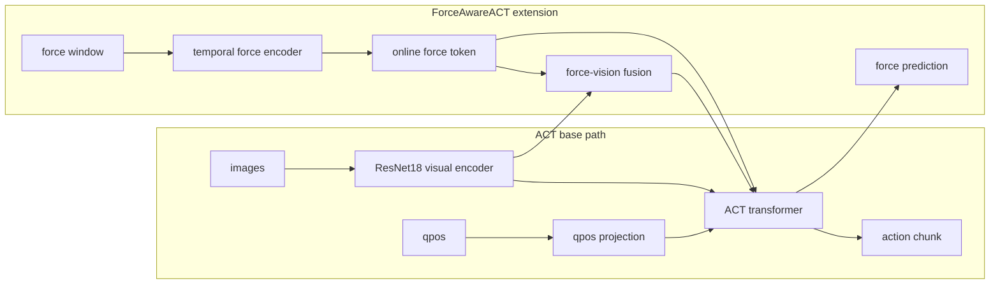

# Experiment Design And Paper Positioning

This document summarizes how to position ForceAwareACT in a paper and how to design clean experiments against an ACT-style baseline. It builds on `docs/architecture/ACT_ALIGNMENT_AUDIT.md`, `docs/architecture/DUAL_LATENT_ALGORITHM.md`, `docs/architecture/VISION_BACKBONE_AUDIT.md`, and `docs/data/ACTION_SEMANTICS.md`.

## Core Experiment Philosophy

ForceAwareACT should be presented as an incremental force-aware extension of ACT, not as a completely different visuomotor policy. For fair comparison, all ACT-compatible components should remain unchanged whenever possible:

- the visual encoder family and initialization,
- proprioceptive input,
- action target semantics,
- action chunking,
- transformer decoder structure,
- and action reconstruction objective.

Improvements should be attributed to force-aware modules only after controlling the visual encoder, qpos encoding, action target, action chunk length, latent inference convention, and L1 action loss. The cleanest story is: start from an ACT-faithful base, then add force sensing in isolated steps.

## What Remains ACT-Faithful

- Multi-camera RGB observations: the dataset and policy use `ee_cam` and `base_top_cam` images with shape `[B, N_cam, 3, H, W]`.
- ResNet18 visual backbone trained from scratch: `train_minimal.py` uses `pretrained_resnet18=False`, consistent with the current ACT-style from-scratch comparison.
- qpos-only proprioception: the policy consumes current `qpos` online; `qvel`, `joint_torque`, and `ee_pose` are loaded but not used by the model.
- qpos projection: `JointMLP` maps `[B, 7]` qpos to one `d_model` token.
- Transformer encoder-decoder: context tokens are encoded and learned future queries decode the action chunk.
- Learned future action queries: `future_queries` has shape `[1, chunk_len, d_model]`.
- Action chunk prediction: `pred_action` has shape `[B, K, 7]`.
- L1 action reconstruction loss: `loss_action = L1(pred_action, action_chunk)`.
- Absolute action/command target: for command-labeled data, `action_mode="action"` predicts `/action[i : i + K]`, the executable actuator command.
- Zero latent at inference: ACT-like inference uses zero latent; in this repository that corresponds to `contact_latent_mode="zero"` and `z_motion=0`.

## What ForceAwareACT Introduces

- High-frequency force window: `force_window [B, L, 6]` summarizes recent wrist force/torque history.
- Temporal force encoder: `TemporalForceEncoder` maps the force window to an online force token `z_F_online`.
- Force-vision cross-attention: force is used as the query and visual tokens are keys/values.
- Fused force-vision token: `z_VF` represents force-conditioned visual context.
- Online force token: `z_F_online` is included in the policy token sequence.
- Auxiliary future force prediction: `ForceHead` predicts `pred_force [B, K, 6]`.
- Force loss: `loss_force = L1(pred_force, future_force_chunk)`, weighted by `lambda_force`.
- Contact latent `z_contact`: a contact-specific latent can be inferred from future action and future force during posterior training.
- Conditional contact prior: a deployable prior predicts contact latent statistics from online visual/force/state features.
- Contact-stage analysis and quality gates: rollout/contact logs support force thresholds, contact correction analysis, and safety-oriented data quality checks.

## Paper-Ready Positioning Sentences

Short contribution sentence:

> We introduce ForceAwareACT, an ACT-style visuomotor imitation policy that incorporates high-frequency wrist force history to improve contact-rich peg-in-hole manipulation.

Method overview sentence:

> ForceAwareACT preserves the ACT action-chunk prediction framework while adding a temporal force encoder, force-conditioned visual fusion, and an auxiliary future-force prediction objective.

Fair-comparison sentence:

> Compared with ACT, our method keeps the visual encoder, proprioceptive encoding, action chunk prediction, and reconstruction objective unchanged, while introducing high-frequency force encoding and force-conditioned visual fusion for contact-stage correction.

More formal Method-section version:

> To isolate the effect of force sensing, we retain the ACT-style multi-camera ResNet18 visual encoder, qpos proprioceptive token, transformer encoder-decoder, learned action queries, absolute action chunk target, and L1 reconstruction loss; ForceAwareACT augments this base policy only with a high-frequency force-window encoder, a force-conditioned visual fusion token, and optional force/contact auxiliary objectives.

Ablation-design sentence:

> We evaluate each force-aware component incrementally, adding force history, force tokens, force-vision fusion, auxiliary force prediction, and contact latents only after establishing an ACT-faithful baseline under identical visual, proprioceptive, and action-label settings.

Force-contact motivation sentence:

> In peg-in-hole insertion, visual observations can be ambiguous after contact, while wrist force and torque reveal lateral misalignment, binding, and unsafe insertion attempts before they are visually apparent.

Data-collection/quality-control sentence:

> We record policy-level command actions with synchronized images, robot state, and high-rate force/torque measurements, and use force-threshold and contact-stage analyses to identify low-quality or unsafe demonstrations.

## Recommended Experiment Matrix

| Experiment | Inputs | Architecture changes | Losses | Action target | Purpose / question answered |
| --- | --- | --- | --- | --- | --- |
| A. ACT baseline | images + qpos | ACT-style ResNet18, qpos token, transformer encoder-decoder, learned future queries | L1 action loss; optional ACT-style motion KL if reporting CVAE variant | absolute `/action` with `action_mode="action"` | Establish the fair ACT-style command-action baseline. |
| B. ACT + force window | images + qpos + force_window | Add force history as an available input in a minimal, explicitly documented way | L1 action loss | absolute `/action` | Does force history alone contain useful contact information? |
| C. ACT + force encoder + force token | images + qpos + force_window | Add temporal force encoder and online force token `z_F_online` | L1 action loss | absolute `/action` | Does learned temporal force encoding improve policy decisions? |
| D. ACT + force-vision fusion | images + qpos + force_window | Add `ForceVisionCrossAttention` and fused token `z_VF` | L1 action loss | absolute `/action` | Does force-conditioned visual context help contact correction? |
| E. ACT + force auxiliary loss | images + qpos + force_window | Add future-force prediction head, preferably after force input/fusion is fixed | L1 action + weighted L1 force | absolute `/action` | Does predicting future contact dynamics improve representations and behavior? |
| F. ForceAwareACT full | images + qpos + force_window | Add force encoder, fusion, force head, `z_contact`, and conditional contact prior | action + force + KL/prior terms as configured | absolute `/action` | Evaluate the full contact-aware architecture after stable deterministic baselines. |
| G. Optional ablations | one factor varied at a time | pretrained vision, extra proprioception, delta target, chunk selector, force-window settings, latent modes | matched except tested factor | matched except tested factor | Attribute gains to specific design choices rather than confounds. |

## Main Baseline Configuration

Recommended current engineering-stable baseline:

```text
action_mode="action"
train_latent_mode="zero"
contact_latent_mode="zero" during rollout
ResNet18 from scratch
qpos only
action_select_mode="mid"
policy_rate_hz=30
max_delta_q=0.01 to 0.02
```

This baseline is deployment-matched and deterministic: training uses zero motion/contact latents and rollout also uses zero contact latent. It avoids the posterior-training versus zero/prior-inference mismatch observed in recent experiments.

For an ACT-faithful CVAE comparison, report posterior latent training with zero latent at inference separately. That comparison is important, but it should not be mixed with `z_contact` or conditional contact prior unless explicitly labeled as a ForceAwareACT extension.

`z_contact` and prior inference should not be included in the ACT baseline. They are force/contact-specific mechanisms and belong in ForceAwareACT-full or latent ablations.

## Ablation Rules

- Change only one factor at a time.
- Do not compare ForceAwareACT with pretrained ResNet18 against ACT with from-scratch ResNet18 as the main result.
- Do not add `qvel`, `joint_torque`, or `ee_pose` to ForceAwareACT unless they are also added to the baseline or reported as separate ablations.
- Use `action_mode="action"` for the main command-action comparison when command labels are available.
- Treat `delta_joint_cmd` and `delta_joint_pos_command` as ablations, not the main ACT-faithful comparison.
- Ablate force loss separately from force input and force-vision fusion.
- Add contact latent and conditional prior only after the force-aware deterministic baseline is stable.
- Keep rollout interpretation, safety clipping, policy rate, and action selection fixed across methods unless those are the factors under test.
- Record every comparison-relevant flag in checkpoint metadata before making claims from a run.

## How To Write The Method Section

Paragraph 1: ACT-style base policy.

Describe the base policy as an ACT-style transformer that receives multi-camera RGB images and current joint positions, encodes images with ResNet18, projects qpos to a proprioceptive token, and decodes a future action chunk using learned action queries.

Paragraph 2: High-frequency force encoding.

Introduce the force window as a history of wrist force/torque samples aligned to the policy timestep. Explain that a temporal force encoder maps this window to an online force token.

Paragraph 3: Force-conditioned visual fusion.

Describe the cross-attention module: the force token queries visual tokens to form a fused force-vision token, allowing contact signals to modulate visual context during ambiguous contact stages.

Paragraph 4: Action and force prediction heads.

State that the decoder predicts the future action chunk and, when enabled, an auxiliary future force chunk. Clarify that future force is used only as a training/evaluation target, not as inference input.

Paragraph 5: Training objective and ablations.

Present the objective as L1 action reconstruction plus optional weighted future-force loss, KL terms for posterior latents, and optional prior distillation. State that ablations isolate force input, fusion, force loss, and contact latents.

## How To Write The Experiment Section

1. ACT baseline comparison.
   Compare against an ACT-faithful baseline with the same cameras, qpos input, from-scratch ResNet18, action chunk length, absolute command target, and rollout settings.

2. Force module ablation.
   Add force-window input, force encoder, force-vision fusion, and force auxiliary loss step by step.

3. Contact-stage performance metrics.
   Report insertion/contact metrics that capture correction quality, not only final success.

4. Data quality and force-threshold analysis.
   Show how force peaks, over-threshold duration, or contact impulses expose unsafe demonstrations or failed insertions.

5. Generalization under hole randomization.
   Evaluate under pose, lateral offset, and contact-condition variation, especially cases requiring correction after first contact.

6. Optional visual-pretraining and extra-proprioception ablations.
   Report these as secondary studies because they change baseline capacity or information access.

## Metrics To Report

Task and geometry metrics:

- success rate,
- insertion depth or final axial error,
- final lateral error,
- minimum peg-to-hole distance,
- contact-stage lateral correction.

Force and safety metrics:

- contact force peak,
- contact impulse,
- force over-threshold duration,
- number or fraction of force-stop events,
- maximum torque if available.

Control and smoothness metrics:

- trajectory smoothness,
- action delta norm,
- applied control delta norm,
- clipping/saturation frequency.

Offline metrics:

- action L1,
- force L1,
- zero/prior/posterior inference-mode gaps when evaluating latent behavior.

Online metrics:

- rollout success,
- contact safety,
- insertion consistency across randomized initial/hole conditions.

## Method Diagram



## Future Config/Profile Plan

These are documentation-level profiles to guide future implementation. Do not treat them as existing CLI profiles yet.

`act_faithful`:

- images + qpos,
- ResNet18 from scratch,
- no force input,
- no force loss,
- no contact latent,
- absolute command target.

`force_aware_minimal`:

- ACT-faithful base plus force-window input,
- minimal force token,
- no contact latent or prior.

`force_aware_fusion`:

- force-aware minimal plus force-vision cross-attention,
- action loss held fixed unless force loss is explicitly ablated.

`force_aware_full`:

- force encoder,
- force-vision fusion,
- force head/loss,
- `z_contact`,
- conditional contact prior.

`force_aware_zero_latent_baseline`:

- current deterministic deployment-matched baseline,
- `train_latent_mode="zero"`,
- `contact_latent_mode="zero"` during rollout,
- absolute command target with `action_mode="action"`.

Future code should expose explicit profiles and individual flags, and should save all profile settings in checkpoint config.

## Bottom Line

The paper should frame ForceAwareACT as a controlled force-aware extension of ACT. The strongest comparison is not "new architecture versus old architecture" in broad terms; it is "ACT-compatible policy plus high-frequency force encoding and force-conditioned fusion" under matched vision, proprioception, action target, action chunking, and reconstruction loss.
